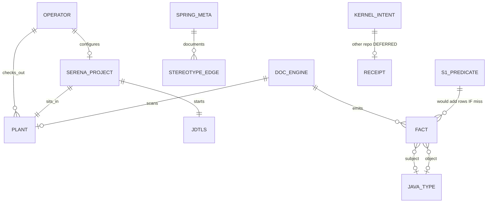

# Entities, relationships, schema

C4 picture: [`adopted-landscape-c4-2026-08-13.md`](adopted-landscape-c4-2026-08-13.md).
Ledger DTO `[Confirmed — facts_model.py:13-29]`. Version
`FACTS_LEDGER_SCHEMA_VERSION = 2` `[Confirmed — facts_model.py:10]`.

## 1. Entities (what exists)

| Entity | Where | Role |
| --- | --- | --- |
| **Operator** | Laptop | Runs Serena and `doc-engine`. |
| **Plant** | OCS unzip | Java 17 tree; not CI fixture. |
| **Serena project** | `plant/.serena/` | `project.yml` + gitignored `project.local.yml`. |
| **jdtls** | `%USERPROFILE%\.serena\language_servers` | Symbol graph. Not Spring-complete (I3). |
| **doc-engine** | this git repo | Scan → artifacts → optional LLM views. |
| **Fact** | `facts.jsonl` | Closed 8-field SoR row. |
| **SpringMetaEdges** | pack `.qll` | Hardcoded Spring meta graph; always on. |
| **Certification fold** | `certification.json` | Derived; S2 must not retune `fail_under`. |
| **Intent / receipt** | future `intent-kernel` | Write CAS. **Not** a Fact. Deferred. |

## 2. Relationships



Morphism: **scan** writes Facts; **LSP** does not write Facts; **CAS** would
write files + a receipt, never this JSONL.

## 3. Fact schema (SoR — do not grow)

All eight keys always present. `extra=forbid`. `line` ≥ 1 when set.

| Field | Type | Meaning |
| --- | --- | --- |
| `predicate` | str | Verb (`MAPS_TO`, `ANNOTATED_WITH`, …). |
| `subject` | str | Usually a type symbol. |
| `object` | str \| null | Other end. |
| `qualifiers` | dict | Provenance, fqcn, display_name. Humans read. |
| `file` | str \| null | Path for `[Evidenced — path:line]`. |
| `line` | int \| null | ≥ 1. |
| `rule_id` | str \| null | Pack / ast-grep id. |
| `scanner` | str \| null | Which scanner emitted. |

On disk: JSON Lines next to `spring_signals.json`
(`[Confirmed — facts_core.facts_path_for_signals_out]`).

```json
{
  "predicate": "ANNOTATED_WITH",
  "subject": "com.elsevier.eols.ocsapi.controller.HomeController",
  "object": "org.springframework.stereotype.Controller",
  "qualifiers": {"fqcn": "...HomeController", "symbol_kind": "type"},
  "file": "src/main/java/.../HomeController.java",
  "line": 7,
  "rule_id": null,
  "scanner": "astgrep"
}
```

## 4. Predicates

**Shipped** `[Confirmed — handlers/facts.py:9-20]`:
`MAPS_TO`, `UNPROVEN`, `REFERENCES`, `DECLARES`, `EXTENDS`, `IMPLEMENTS`,
`ANNOTATED_WITH`, `X`.

**S1 would add (same eight keys, new predicate names)** — idle:

| Predicate | Object | Why it waited |
| --- | --- | --- |
| `ANNOTATED_WITH` (resolved) | annotation FQCN | Meta/inherited ast-grep misses |
| `EFFECTIVE_MAPPING` | `GET /` | Class+method composition |
| `TRANSACTIONAL_ON` | isolation or `true` | Interface inheritance |
| `WIRES_BEAN` | bean id/type | Ctor vs field the DB sees |

`qualifiers.provenance` ∈ `exact` \| `spring_meta_edge` \| `probe_gated` \|
`unproven`. Not model trust (S2 ablation).

OCS 2026-08-13 grep: no interface `@Transactional`, no custom `@interface`
stereotype → those S1 rows have **nothing to recover on this plant**.

## 5. SpringMetaEdges (not a table we migrate)

Hardcoded edges in `SpringMetaEdges.qll` (Service→Component,
RestController→Controller, GetMapping→RequestMapping, …). Always on.
Discovered-meta (`metaResolutionEnabled`) stays `none()` until `Probe.ql`
PASS on a real DB in the **same** PR as a flip `[Confirmed — S1 FR-S1-03]`.

## 6. What is not in the schema

No SPO triples store. No embedding index. No Intent columns on Fact.
No `utils/` bag. Kernel receipt JSON lives only if E-IK0 is built
elsewhere.
