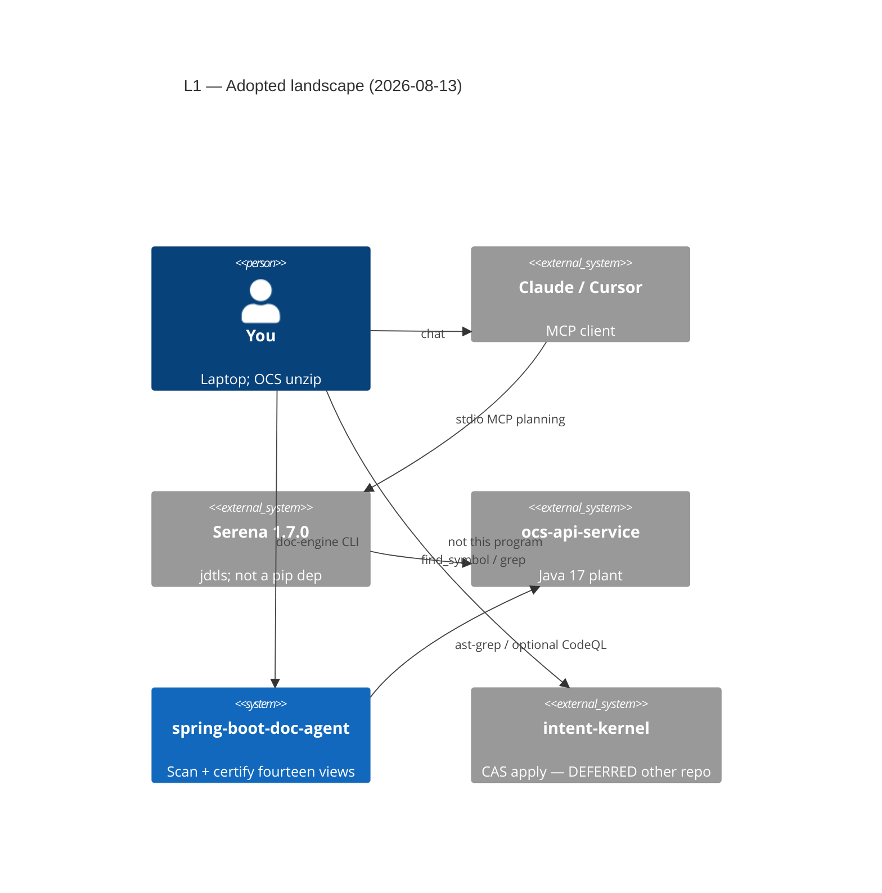
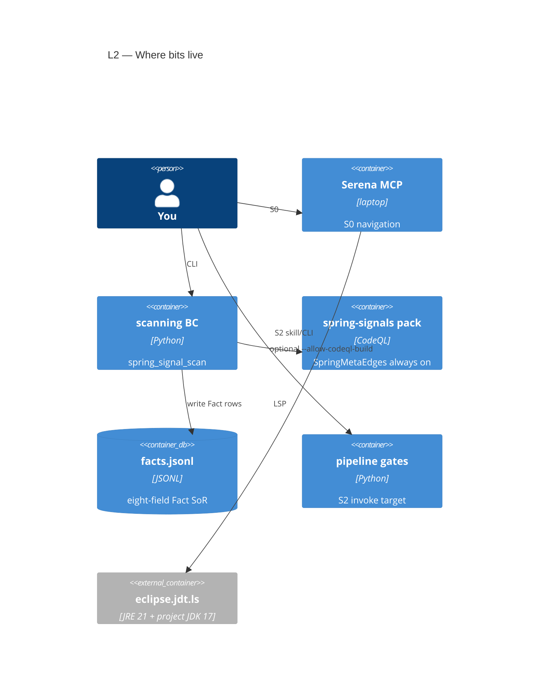
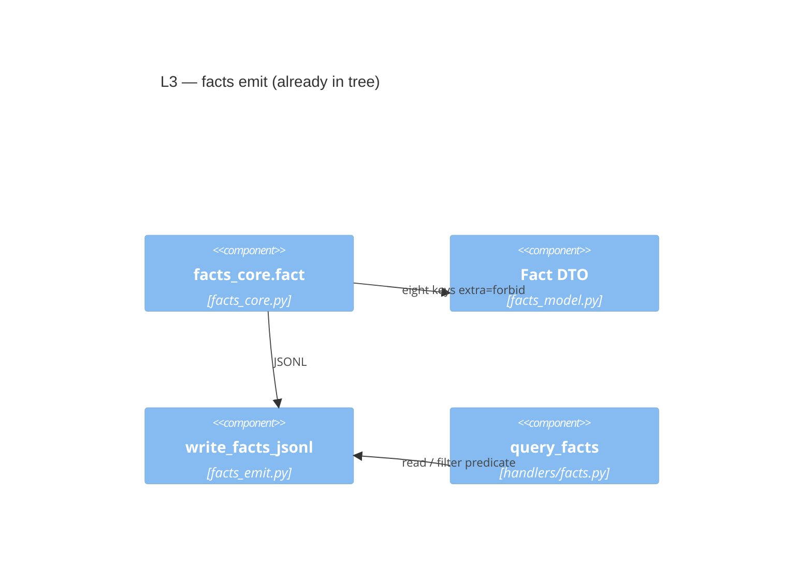
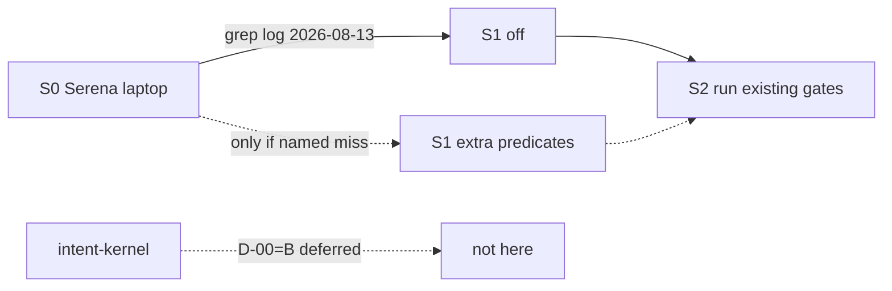

# What is going on (C4)

One sentence: **this plugin scans Spring and writes docs; Serena is a laptop
IDE for the Java tree; a write-kernel is a different repo we are not
building now.**

| Stamp | Meaning |
| --- | --- |
| **Adopt (operator)** | Serena + jdtls on OCS. Not in `requirements.txt`. |
| **Embody (this repo)** | Existing `facts.jsonl` + CodeQL pack. S1 only after a **named miss**. |
| **Adopt later (skill)** | S2: agent **runs** gates we already have. |
| **Defer** | `intent-kernel` CAS write (D-00=B). Other C4: `intent-kernel-cas-apply-design-2026-08-13.md`. |
| **Refuse** | Custom index, SPO graph, planner, OPA, LiteLLM-in-front, S1 on this OCS log. |

S0 grep log: [`s0-ocs-run-log-2026-08-13.md`](s0-ocs-run-log-2026-08-13.md)
— **S1 not authorized**. Schema:
[`adopted-entities-schema-2026-08-13.md`](adopted-entities-schema-2026-08-13.md).

## Bloom

| Level | Evidence |
| --- | --- |
| Remember | Serena `find_symbol` `[Evidenced — oraios tools]`. `Fact` eight keys `[Confirmed — facts_model.py:13-29]`. |
| Understand | Scan SoR ≠ LSP session ≠ CAS write. |
| Apply | S0 = MCP on OCS; S1 = extra predicates on same JSONL; S2 = invoke `pipeline gates`. |
| Analyze | Two homes. Cut list in parent README. |
| Evaluate | Drawing S1 as always-on false-greens the kill rule. |
| Create | This map + schema file. No `src/` tickets. |

```text
Iso: observe→act→remeasure ≅ S2 invoke | I3: pass-rate ≠ fail_under
| I5: facts.jsonl stays closed eight-field SoR
```

## L1 — System context

Solid = now. Dashed = deferred or not authorized.



## L2 — Containers (this repo + laptop)



S1 would be **more rows in the same ledger**, not a new database. Idle until
a miss exists.

## L3 — Scan emit (code)



`KNOWN_PREDICATES` today: `MAPS_TO`, `UNPROVEN`, `REFERENCES`, `DECLARES`,
`EXTENDS`, `IMPLEMENTS`, `ANNOTATED_WITH`, `X`
`[Confirmed — handlers/facts.py:9-20]`.

## Sequence (operator)


