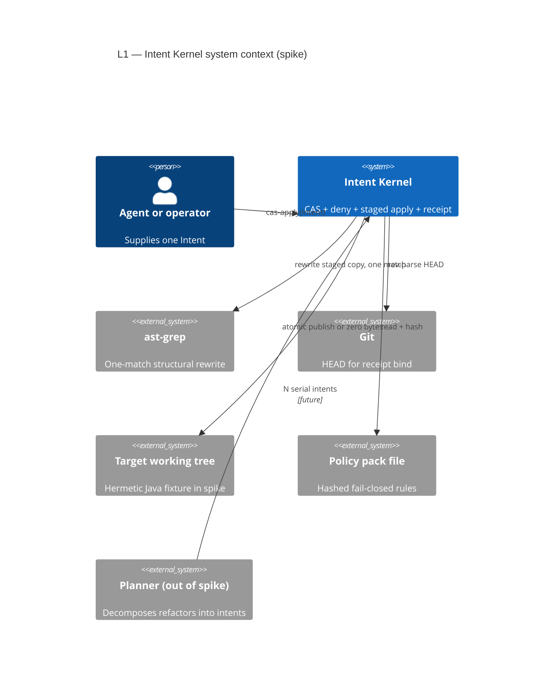
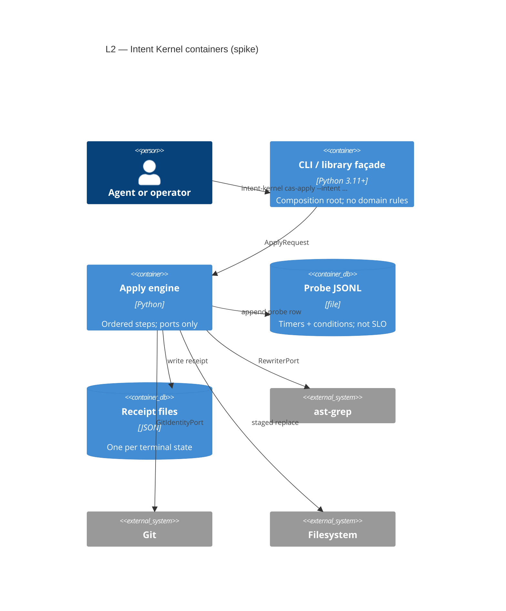
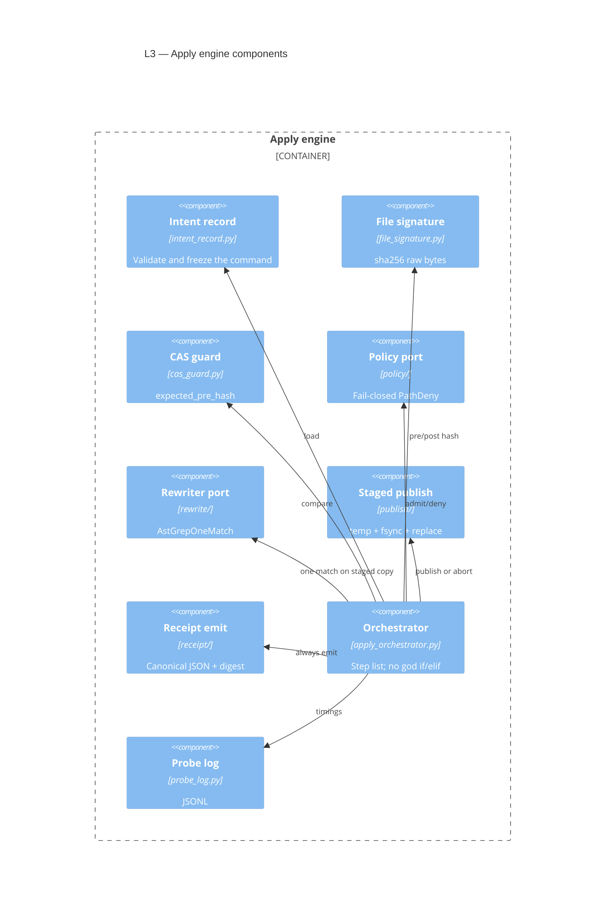
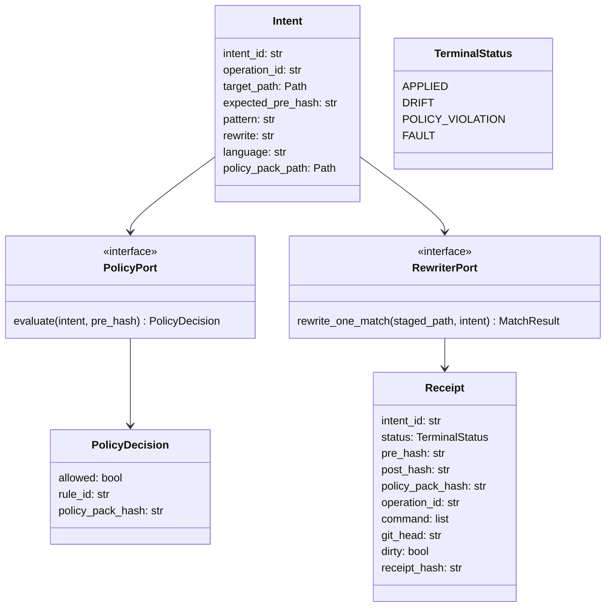
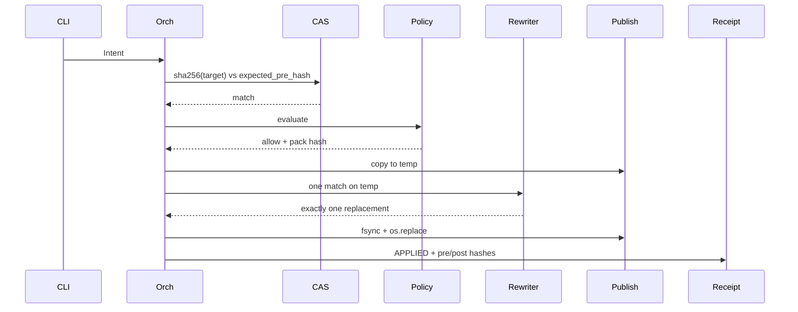
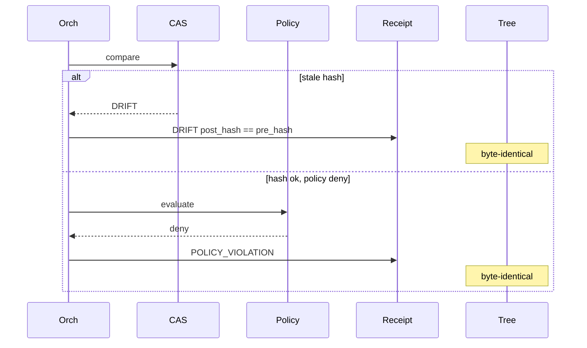
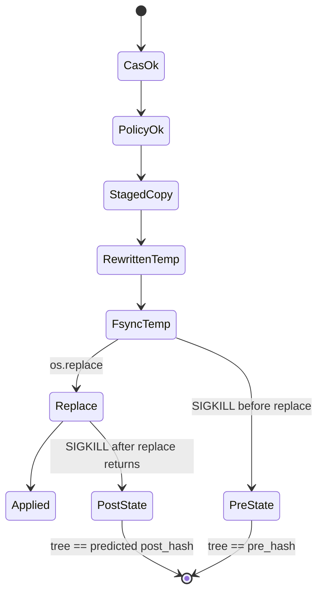

# Intent Kernel — system-of-systems spec (spike)

**System of interest:** a CLI/library that performs **one compare-and-swap
apply** of **one** structural rewrite, under **one** fail-closed policy, and
emits a **receipt**. It does not refactor a codebase. It does not coordinate
transactions. It does not talk MCP.

**Constituent systems it does *not* replace:** the agent host, ast-grep,
git, the working tree, a future planner, a future policy pack author.

Iso: SoS operational independence (Maier) ≅ ports + versioned JSON contracts
→ land as adapters | non-preserved: shared process / shared release train |
I5: no merge-SoT in doc-engine

---

## 0. Decisions locked in this spec

| ID | Choice | Why |
| --- | --- | --- |
| D-00 | **B — greenfield repo** `intent-kernel` | Mutating join ≠ scan/certify wheel. This tree is citation, not home. |
| D-01 | **(b) single-node** + **one match** | `--update-all` multi-hit is not a coordinator. Planner (out of spike) owns N intents. |
| D-02 | temp file + `fsync` + `os.replace` | POSIX publish; 5c kills between write and replace. |
| D-03 | product `intent-kernel`; verb `cas-apply` | Provenance, not “verified architecture.” |

Unblock for Implement (elsewhere): this spec + five failing tests in the
greenfield tree. Not nine research gates. Not this repo’s Active tip.

---

## 1. C4 — Level 1 System Context



**Boundary:** dashed planner is *not* in the spike binary. Agent may be a
human CLI user.

---

## 2. C4 — Level 2 Containers



One deployable: a Python package + console script. No service, no DB, no
MCP stdio in spike.

---

## 3. C4 — Level 3 Components



---

## 4. C4 — Level 4 Code (types, not theater)



`FAULT` is only for “could not establish git HEAD when receipt requires it”
or “rewriter crashed before publish.” Disk after `FAULT` on publish path must
still be pre or post (5c), never a mix.

---

## 5. Sequences

### 5.1 Happy path (FR-01)



### 5.2 Drift / deny (FR-02, FR-03) — zero bytes on target



### 5.3 Crash mid-publish (FR-05c)



There is no `Partial` disk state on POSIX rename of one file.

---

## 6. System of systems

Maier / ISO/IEC/IEEE 21839: a SoS is not a modular monolith. Constituents
are **operationally and managerially independent**. The kernel is the
**system of interest**; others keep their own release trains.

| Constituent | Independence | Contract with kernel | Spike? |
| --- | --- | --- | --- |
| Agent host | Own UX, models, tools | argv / Python API `cas_apply(Intent)` | Caller only |
| **Intent Kernel** | Own version, tests, pins | This spec | **Yes** |
| ast-grep | Own CLI/semver | `RewriterPort`; pin version; never trust exit code | Adapter |
| Git | Own binary | `GitIdentityPort`: HEAD or fail closed | Adapter |
| Working tree | Operator-owned | Path containment: target must resolve inside `--tree-root` | Fixture |
| Policy pack | Data file, hashed | JSON list of deny globs; pack hash in receipt | One rule |
| Planner | Future; own repo | Emits N `Intent`s; never inside kernel | **No** |
| MCP adapter | Future | Server-pinned root; no caller `root` | **No** |
| LiteLLM gateway | Different plant | None | **No** |

**Emergent property (the only reason this exists):** none of ast-grep, git,
or `os.replace` alone give *stale-safe, policy-gated, attested* mutation.
That property appears only at the join.

**Managerial split:** kernel CI does not run doc-engine 98.7. doc-engine CI
does not run kernel apply. Citation, not a workspace bang.

---

## 7. Functional requirements

Witness for all write-path FRs: **sha256 of target bytes**, not process RC.

| ID | Requirement | Acceptance |
| --- | --- | --- |
| **FR-01 Apply** | One intent, one file, one AST match; publish; `post_hash` equals hash of rewritten bytes. | Test `test_apply_one_match`. |
| **FR-02 Drift** | Stale `expected_pre_hash` → status `DRIFT`; target byte-identical to pre. | `test_drift_zero_bytes`. |
| **FR-03 Deny** | Policy deny → `POLICY_VIOLATION`; target byte-identical. | `test_deny_zero_bytes` with one deny glob. |
| **FR-04 Receipt** | Every terminal state writes a receipt with `intent_id`, `pre_hash`, `post_hash`, `policy_pack_hash`, `operation_id`, `command`, `status`, `receipt_hash` (sha256 of canonical JSON without that field). | `test_receipt_fields` for APPLIED, DRIFT, POLICY_VIOLATION. |
| **FR-04a HEAD** | If git is required, missing HEAD → do not emit a receipt that claims a HEAD; status `FAULT`; no publish. | `test_receipt_git_fail_closed`. |
| **FR-04b Dirty** | Dirty tree is recorded `dirty=true`; not a deny. | `test_dirty_unrelated_apply` (5a). |
| **FR-05a** | Unrelated uncommitted files; target still matches pre-hash → apply succeeds. | `test_dirty_unrelated_apply`. |
| **FR-05b** | Re-run **same** Intent after APPLIED → `DRIFT` (pre-hash stale). Not idempotent success. | `test_rerun_is_drift`. |
| **FR-05c** | Kill between temp write and `os.replace` → target still pre-hash. Kill after replace returns → post-hash. Never a truncated target. | `test_crash_before_replace`, `test_crash_after_replace`. |
| **FR-06 One match** | 0 matches → `FAULT` (or dedicated `NO_MATCH`); no publish. 2+ matches → `FAULT` `MULTI_MATCH`; no publish. | `test_zero_match_no_write`, `test_multi_match_no_write`. |
| **FR-07 Containment** | `target_path` must resolve inside `--tree-root`. Escape → `FAULT`; no write. | `test_path_escape_denied`. |
| **FR-08 Probe** | Each run appends one JSONL object: step name, ms, status, fixture id. Labeled `probe`, never SLO. | `test_probe_jsonl_row`. |
| **FR-09 CLI** | `intent-kernel cas-apply --tree-root DIR --intent FILE`. Flags are words, not `m`/`o`/`c`. | `test_cli_help_names`. |

Non-goals (not FRs): multi-file txn, MCP, planner, OpenRewrite adapter,
OPA, line-hash protocols, Windows atomicity (POSIX spike).

---

## 8. Non-functional requirements

| ID | Requirement | Acceptance |
| --- | --- | --- |
| **NFR-01 Hermetic** | Spike tests use `fixtures/java-one-node/` only. No network, no OCS, no Artifactory. | Tests collect without net. |
| **NFR-02 Determinism** | Same Intent + same tree 20× → identical post bytes and receipt fields except timestamps. | `test_apply_repeatable`. Timestamp fields excluded from `receipt_hash` or canonicalized to a test clock. |
| **NFR-03 POSIX publish** | `os.replace` same-directory temp. `fsync` file (and dir if feasible) before replace. | 5c + code review of `staged_replace.py`. |
| **NFR-04 Pins** | `ast-grep` version in `pyproject` optional-dep or docs pin; tests skip-fail if binary missing with explicit skip reason **or** require it in CI image. | CI image lists version. |
| **NFR-05 Size** | Every `src/` and `tests/` module ≤ **225** LOC. | size ratchet. |
| **NFR-06 Complexity** | `complexipy` ≤ **5** per function. | CI. |
| **NFR-07 Coverage** | `fail_under` on `intent_kernel` **95.0** (new repo; do not cargo-cult 98.7). The **five behaviours are SoR**; coverage is necessary, not sufficient. | cov cell + behavioural tests. |
| **NFR-08 Probe not SLO** | No p95 in code as a gate. No OTel. | grep deny `opentelemetry`. |
| **NFR-09 Secrets** | Policy pack and receipts must not embed file bodies. Hashes only. | `test_receipt_has_no_source_body`. |
| **NFR-10 Clock** | Orchestrator takes a `ClockPort` (injectable). Tests freeze time. | constructor injection. |

Latency: record probes. Do **not** write `C-LOCATE-P95` until a named plant
exists post-spike.

---

## 9. Constraints (hard denies)

| ID | Constraint |
| --- | --- |
| **CR-01** | No `utils/`, `helpers/`, `common/`, `misc/`, `core.py` god module. Concept-named packages only. |
| **CR-02** | No single-letter CLI flags. |
| **CR-03** | No MCP server in spike. |
| **CR-04** | No OPA/Rego runtime. One `PathDeny` strategy. |
| **CR-05** | No in-tree Rust. ast-grep remains an **external** binary. |
| **CR-06** | Hash primitive is **file sha256**. No 4-hex/2-hex/CRC32 CAS. |
| **CR-07** | Kernel is not a transaction coordinator. No `expected_pre_hashes[]`. |
| **CR-08** | Do not honor caller-supplied roots that escape `--tree-root`. |
| **CR-09** | Do not use ast-grep exit code as SoT. |
| **CR-10** | Do not degrade missing git to `HEAD=null` in a “success” receipt. |
| **CR-11** | Do not implement inside `src/doc_engine/`. |
| **CR-12** | Do not fold LiteLLM/gateway into this repo. |
| **CR-13** | Policy evaluate **before** any rewrite of a published path. Staged copy may be rewritten only after allow. |
| **CR-14** | `receipt_hash` is sha256 of canonical JSON (sorted keys, no whitespace variance). |

---

## 10. Repository tree (greenfield `intent-kernel`)

Names are capabilities, not layers (`services/`, `managers/`) and not
residuals (`misc.py`).

```text
intent-kernel/
  README.md
  pyproject.toml              # ruff, pytest, complexipy, size, cov fail_under 95
  tach.toml                   # one-way: cli → apply → ports; adapters not imported by records
  .github/workflows/ci.yml    # 3.11; no network; ast-grep pin
  fixtures/
    java-one-node/
      TreeRoot.java           # one method the pattern hits once
      Unrelated.java          # dirty-tree sibling
  src/intent_kernel/
    __init__.py               # version only
    cli.py                    # composition root; argparse words
    apply_orchestrator.py     # ordered Step list
    intent_record.py          # Intent freeze/validate
    file_signature.py         # sha256
    cas_guard.py
    terminal_status.py        # enum
    clock_port.py
    probe_log.py
    git_identity.py           # GitIdentityPort impl
    path_containment.py
    policy/
      port.py                 # Protocol
      path_deny.py            # one fail-closed strategy
    rewrite/
      port.py
      astgrep_one_match.py    # count matches; refuse 0 or 2+
    publish/
      staged_replace.py
    receipt/
      record.py               # Receipt dataclass + canonical json
      emit.py
  tests/
    conftest.py               # tree_root fixture, frozen clock
    test_apply_one_match.py
    test_drift_zero_bytes.py
    test_deny_zero_bytes.py
    test_receipt_fields.py
    test_receipt_git_fail_closed.py
    test_dirty_unrelated_apply.py
    test_rerun_is_drift.py
    test_crash_before_replace.py
    test_crash_after_replace.py
    test_zero_match_no_write.py
    test_multi_match_no_write.py
    test_path_escape_denied.py
    test_probe_jsonl_row.py
    test_cli_help_names.py
    test_apply_repeatable.py
    test_receipt_has_no_source_body.py
```

### Module budgets (NFR-05 / cohesion)

| Module | Owns | Max LOC |
| --- | --- | --- |
| `cli.py` | parse, wire ports, exit codes | 80 |
| `apply_orchestrator.py` | step sequence only | 120 |
| `intent_record.py` | fields + validation | 80 |
| `file_signature.py` | sha256 | 40 |
| `cas_guard.py` | equality | 40 |
| `policy/port.py` | Protocol | 30 |
| `policy/path_deny.py` | glob deny | 80 |
| `rewrite/port.py` | Protocol | 30 |
| `rewrite/astgrep_one_match.py` | invoke + count | 120 |
| `publish/staged_replace.py` | temp, fsync, replace | 80 |
| `receipt/record.py` | schema + canonical hash | 100 |
| `receipt/emit.py` | write file | 50 |
| `git_identity.py` | rev-parse / dirty | 70 |
| `path_containment.py` | resolve + is_relative_to | 50 |
| `probe_log.py` | JSONL append | 50 |
| `clock_port.py` | Protocol + system clock | 30 |
| `terminal_status.py` | enum | 30 |
| each `tests/test_*.py` | one behaviour | 120 |

If a file exceeds 225, **split by concept** (second strategy, not `part2.py`).

### Import rule (tach)

```text
cli → apply_orchestrator
apply_orchestrator → intent_record, cas_guard, file_signature,
                     policy.port, rewrite.port, publish, receipt,
                     git_identity, path_containment, probe_log, clock_port
policy.path_deny → policy.port
rewrite.astgrep_one_match → rewrite.port
receipt.emit → receipt.record
# forbid: record modules importing cli; policy importing rewrite
```

---

## 11. Coding standard × SoS (the crossing)

SoS contracts are **JSON + ports**. In-process quality is **small cohesive
modules**. Do not violate one to satisfy the other (a 400-line orchestrator
that “just calls ast-grep” is a constituent leak *and* a size fail).

| SoS rule | Code rule |
| --- | --- |
| Constituents independent | `RewriterPort` / `PolicyPort` / `GitIdentityPort` / `ClockPort` — no subprocess in `intent_record.py` |
| Emergent join is the product | Orchestrator is a **list of named steps**, each returning a result object; no nested if-ladders (complexipy ≤5) |
| Versioned contracts | `Intent` and `Receipt` are dataclasses with explicit required fields; pydantic only if it stays <80 LOC in `intent_record.py` |
| Fail closed | Exceptions at edges become `TerminalStatus` + receipt; never “warn and continue” on HEAD or CAS |
| Witness | `file_signature.sha256_file` is the only hash helper; tests assert digest, not stdout |
| Adapter isolation | `astgrep_one_match.py` may shell out; it returns `MatchCount` + staged path. Orchestrator decides FAULT vs publish |
| No grab-bag | New code = new concept module or new strategy class under `policy/` / `rewrite/` |
| Descriptive names | `expected_pre_hash`, `tree_root`, `cas-apply` — never `--h` as the hash flag |
| Tests as SoR | One test module per FR row above; names match IDs in the docstring first line: `FR-02 Drift` |
| Coverage sensor | 95% fail_under on the package; a 100% file that never asserts byte-identity is a fail of FR-02 |

**Exit codes (CLI):** `0` APPLIED; `2` DRIFT; `3` POLICY_VIOLATION; `4` FAULT.
Stable; documented in README. Do not overload `1` for all failures.

**Canonical receipt JSON:** UTF-8, `sort_keys=True`, `separators=(",", ":")`,
no `receipt_hash` inside the hashed body (write it after).

---

## 12. Intent and receipt shapes (spike)

```text
Intent
  intent_id:           uuid/ulid string
  operation_id:        "astgrep_one_match"
  tree_root:           path
  target_path:         path relative to tree_root
  expected_pre_hash:   sha256 hex
  language:            "java"
  pattern:             ast-grep pattern (one metavariable max in spike)
  rewrite:             ast-grep rewrite string
  policy_pack_path:    path inside tree_root or config dir
```

```text
Receipt
  schema_version:      1
  intent_id
  operation_id
  status               APPLIED | DRIFT | POLICY_VIOLATION | FAULT
  fault_reason         optional enum: NO_MATCH | MULTI_MATCH | GIT_UNAVAILABLE | PATH_ESCAPE | REWRITE_CRASH
  pre_hash
  post_hash            equals pre_hash on DRIFT/DENY/FAULT-before-publish
  policy_pack_hash
  git_head             omitted unless present; never null-on-success
  dirty                bool
  command              argv list actually executed for rewrite (empty if not invoked)
  probe_file           optional path
  receipt_hash
```

Policy pack spike:

```text
{ "schema_version": 1, "deny_globs": ["**/secrets/**"] }
```

Empty `deny_globs` is valid (always allow) but pack still hashes.

---

## 13. False-green / false-red (evaluate)

| Failure | Why it looks green | Guard |
| --- | --- | --- |
| ast-grep RC=1 | “rewrite failed” vs “no match” | FR-06 count replacements on staged copy |
| Coverage 95% | Tests don’t assert bytes | FR-02/03 sha256 equality |
| Idempotent re-run | Author “fixed” 5b | FR-05b must be DRIFT |
| Partial file | Crash after write, before replace | FR-05c |
| Caller `../` path | Wrote outside fixture | FR-07 |
| HEAD `None` | Copied doc-engine degrade | FR-04a |
| Two matches | “rename method” in one file | FR-06 |

---

## 14. Spike Implement tickets (Create) — greenfield only

| ID | Title | Acceptance |
| --- | --- | --- |
| **IK-S0** | Repo skeleton | Tree above; ratchets wired; no domain logic. |
| **IK-S1** | Five+ failing tests | All FR-* tests exist and fail. |
| **IK-S2** | Ports + orchestrator | Steps; complexipy ≤5; LOC budgets. |
| **IK-S3** | ast-grep one-match adapter | FR-01 and FR-06 green. |
| **IK-S4** | CAS + policy + publish | FR-02, FR-03, FR-05c green. |
| **IK-S5** | Receipts + git fail-closed | FR-04* green. |
| **IK-S6** | CLI words + probes | FR-08, FR-09. |

**Stop.** Bake-off matrix and ISA are post-spike. MCP, planner, LiteLLM are
other systems.

---

## 15. What this repo (spring-boot-doc-agent) does

Cite, do not copy:

- `_write_json_atomic` → same *shape* as `staged_replace.py` (new code).
- `Mutator._apply_structural` → bytes-not-RC.
- `dispatch_tool` popping `root` → FR-07 / CR-08.
- `compute_file_signature` → sha256 raw bytes.

Do **not** import `doc_engine` from `intent-kernel`.
