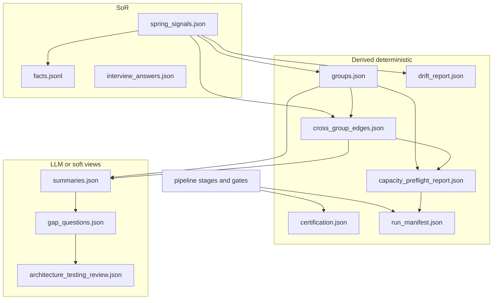

# Schema coverage corpus — product pipeline artifacts (2026-07-30)

**Status:** research inventory (evidence only).  
**Companion:** [schema-serde-approaches-collation-2026-07-30.md](schema-serde-approaches-collation-2026-07-30.md), [schema-contracts-decision-memo-2026-07-30.md](schema-contracts-decision-memo-2026-07-30.md).  
**Supersedes sequencing role of:** [`../deterministic-boundary-schemas-spi-research-2026-07-29.md`](../deterministic-boundary-schemas-spi-research-2026-07-29.md) (that note remains useful for write-vs-read questions; this corpus is the artifact SoT table).

**Scope:** product inter-stage / operator artifacts under `src/doc_engine/`.  
**Out of scope:** `repo_claims_baseline.json`, rule/mutation baselines, `plugin.json`, friend-review dumps.

---

## 1. Taxonomy (DDIA Ch1)

| Class | Meaning here | Artifacts |
|-------|----------------|-----------|
| **SoR** | Authoritative for a slice of truth; other stages derive from it | `spring_signals.json`, `facts.jsonl` (sidecar ledger), `interview_answers.json` (human SoR) |
| **Derived deterministic** | Pure function of SoR / prior deterministic outputs | `groups.json`, `cross_group_edges.json`, `drift_report.json`, `capacity_preflight_report.json`, `certification.json`, `run_manifest.json` |
| **View (LLM / soft)** | Generative or soft-contract; must fail closed on shape when certified | `summaries.json`, `gap_questions.json`, `architecture_testing_review.json` |

---

## 2. Artifact inventory (as of main @ #65 + facts dual-emit)

Legend — **Contract:** Pydantic model / exported JSON Schema / imperative validator / hand schema / none.  
**Openness:** `extra=allow` | `extra=forbid` | free `dict` | RootModel list.

| Artifact | Encoding | Class | Contract today | Version on wire | Openness | Producer | Primary consumers |
|----------|----------|-------|----------------|-----------------|----------|----------|-------------------|
| `spring_signals.json` | JSON object | SoR | Pydantic `SpringSignalsArtifact` + [`scripts/schemas/spring_signals.schema.json`](../../scripts/schemas/spring_signals.schema.json) | `schema_version` ≥2 (emit ~7) | `extra=allow` (nested EvidenceMatch too) | `doc_engine.tools.spring_signal_scan` / scan merge | partition, edges, drift, facts projection, LLM context, `validate_artifacts` |
| `groups.json` | JSON object | Derived | Pydantic `GroupsArtifact` + schema | **none** | mostly closed; `skipped` allows dict | `partition_repo` | edges, capacity, Stage 1 fan-out |
| `summaries.json` | JSON array | View | Pydantic `SummariesArtifact` + schema **and** `validate_file_summarizer_entries` | none | closed required keys | file-summarizer / mock | gap-analyzer, Stage 5 gate, doc-writer |
| `interview_answers.json` | JSON array | SoR (human) | Pydantic `InterviewAnswersArtifact` + schema | none | closed fields | interview / human | doc-writer, cert/manifest interview block |
| `facts.jsonl` | JSONL | SoR sidecar | Pydantic `Fact`/`FactsArtifact` + schema | `FACTS_LEDGER_SCHEMA_VERSION=1` (export annotation) | `extra=forbid` | `scanning.facts` | `validate_artifacts` |
| `cross_group_edges.json` | JSON object | Derived | Pydantic `CrossGroupEdgesArtifact` + schema | `schema_version`: 1 | top-level allow nested | `build_cross_group_edges` | Stage 1, capacity, `--all` |
| `gap_questions.json` | JSON array | View | Pydantic + Stage 5 imperative | none | required keys + allow | gap-analyzer | Stage 5 + `--all` |
| `architecture_testing_review.json` | JSON **array** | View | Pydantic + Stage 5 (**B4 wired**) | none | required keys + allow | software-architect-and-testing | Stage 5 + `--all` |
| `certification.json` | JSON object | Derived (audit) | `CertificationReport` + exported schema + `--all` + verify load | `schema_version`: 1 | default | `write_certification_json` | `certification verify` |

| `run_manifest.json` | JSON object | Derived (telemetry) | hand schema [`scripts/schemas/run_manifest.schema.json`](../../scripts/schemas/run_manifest.schema.json) + shape tests | `schema_version`: 1 | documented required keys | `run_manifest` tool | drift optional baseline, finalize/summary |
| `drift_report.json` | JSON object | Derived | free dict from `check_drift` | **none** | open | `spring_drift_check` | operators / local_runner optional |
| `capacity_preflight_report.json` | JSON object | Derived | Pydantic `CapacityPreflightReportArtifact` + schema | `schema_version`: 1 | `extra=allow` | `capacity_preflight` | `run_manifest finalize` tie-in / `validate_artifacts` |

**Count check vs external review §7:** At research start, “4 of ~10” with Pydantic + exported JSON Schema = `spring_signals`, `groups`, `summaries`, `interview_answers`. **Slice 1 adds `facts`** → 5 exported schemas. Remaining gaps: edges, review, gap_questions, capacity, drift; cert typed but export is slice 2.

---

## 3. Registry SoT

| Registry | Location | Contains |
|----------|----------|----------|
| `ARTIFACT_MODELS` / `ARTIFACT_FILENAMES` | [`src/doc_engine/pipeline/artifacts.py`](../../src/doc_engine/pipeline/artifacts.py) | Five named artifacts including `facts` |
| `JSONL_ARTIFACTS` | same | Marks `facts` as line-oriented |
| Exported schemas | `scripts/schemas/*.schema.json` | Five files (includes `facts.schema.json`); must stay derived from models |
| Stage graph outputs | [`src/doc_engine/pipeline/stages.py`](../../src/doc_engine/pipeline/stages.py) | Declares filenames including `facts.jsonl`, `cross_group_edges.json`, capacity report |
| Stage 5 gate | [`pipeline_validators.run_stage5_gate`](../../src/doc_engine/tools/pipeline_validators.py) | summaries + gap_questions only |
| Cert gates | [`compliance.py`](../../src/doc_engine/pipeline/compliance.py) | `validate_artifacts_*`, `pipeline_validators`, etc. |
| CI | [`.github/workflows/ci.yml`](../../.github/workflows/ci.yml) | Fixture spring_signals validate; deterministic_only run then `validate_artifacts --all` |

---

## 4. Serde matrix (encode / decode / round-trip / mutation)

Status codes: **pass** = exercised in CI or dedicated tests; **partial** = model or validator exists but gap; **untested** = no automated contract test; **n/a** = not applicable yet.

| Artifact | Encode path | Decode path | Round-trip (contract projection) | Drop required | Unknown key | Wrong type / line&lt;1 | Empty / blank |
|----------|-------------|-------------|----------------------------------|---------------|-------------|------------------------|---------------|
| spring_signals | `json.dump` merge bag | `model_validate` / fixture CI | **partial** (fixture validates; full dump↔model not property-tested) | **pass** (schema_version≥2) | **pass** (allow) | **partial** | n/a |
| groups | partition `json.dump` | Pydantic | **untested** as RT | **partial** | **partial** | **partial** | n/a |
| summaries | LLM/mock JSON array | Pydantic + imperative Stage 5 | **partial** (dual validators) | **pass** | extras may slip past imperative if not in Pydantic path | **pass** (evidence.line) | empty array OK |
| interview_answers | human/tool JSON | Pydantic | **partial** | **partial** | **partial** | **partial** | empty OK |
| facts.jsonl | `json.dumps(..., sort_keys=True)` per line + `Fact` write validate | JSONL loader + `FactsArtifact` | **pass** (tests) | **pass** | **pass** (`forbid`) | **pass** | blank lines skip; bad line rejects |
| cross_group_edges | `json.dump` dict | `json.load` consumers | **untested** | **untested** | silent allow | **untested** | n/a |
| gap_questions | LLM/mock | `json.load` + imperative | **partial** (gate) | **pass** (gate) | silent allow | evidence string rules | empty list OK |
| architecture_testing_review | LLM | helper only | **untested** in gate | helper **pass** in unit tests | silent allow | helper **pass** | — |
| certification | `model_dump` → `json.dumps` | verify CLI / load | **partial** | **partial** | default ignore | **partial** | n/a |
| run_manifest | tool updates | hand shape tests | **partial** | **pass** (shape tests) | **partial** | **partial** | n/a |
| drift_report | `json.dump` | operators | **untested** | **untested** | allow | **untested** | n/a |
| capacity_preflight_report | `json.dump` + `schema_version` | `model_validate` / `--all` | **pass** (contract tests) | **pass** (`schema_version`) | **pass** (allow) | **pass** (metric_kind) | n/a |

### Mutation algebra (decidable cases to implement later)

For a typed language \(L\) over encoding \(E\):

1. \(\mathrm{decode}_L(\mathrm{encode}_E(x)) \equiv \pi_L(x)\) (projection onto contract fields).
2. Drop required key \(\Rightarrow\) reject.
3. Add unknown key \(\Rightarrow\) allow iff open world; reject iff closed.
4. Wrong scalar type or `line < 1` \(\Rightarrow\) reject.
5. JSONL: blank lines skipped; invalid JSON line \(\Rightarrow\) reject with line number.
6. Contested multi-`MAPS_TO`: arity ≥2 preserved under serde (facts ledger).

---

## 5. Cross_group_edges shape (producer evidence)

`build_cross_group_edges.build_report` returns (among others):

- `schema_version` (=1)
- `repo_path`, `num_groups`, `references_rows`
- `stats` (broadcast vs shipped reduction)
- `groups`: map of group-id → `{outbound, inbound, same_package_outside, ...}`

No Pydantic model; no exported schema.

---

## 6. Drift / capacity shapes (producer evidence)

**drift_report:** `repo_path`, `prior_scan_repo_path`, `file_signatures_baseline`, `file_summary`, `citations_checked`, `status_counts`, `results[]`.

**capacity_preflight_report:** `schema_version`, shared stage4 pool + `warnings[]` (required); Stage-0 also emits `num_groups` / fan-out / slice / `edge_join_stats`; L2b calibration adds `mode` / proxy comparison.

---

## 7. External standards consulted (bounded)

| Source | Use |
|--------|-----|
| DDIA 2e Ch1 / Ch5 | SoR vs derived; explicit schemas |
| Pydantic v2 `extra=forbid` / `allow` | Closed vs open world |
| JSON Schema (draft via `model_json_schema`) | Export for CI / external readers |
| In-repo: fact-store Phase 1 memo, facts-ledger-schema note, 2026-07-29 deterministic-boundary note | Sequencing; do not invent SPI |

No Neo4j/Glean-as-product; no full JPA vocabulary in schemas.

---

## 8. Risk ranking (gap × blast radius)

1. **architecture_testing_review** — soft view feeding trust; validator exists but **unwired** (B4).
2. **facts.jsonl** — SoR sidecar already emitted; closed contract incomplete on main.
3. **cross_group_edges** — Stage 1 cost/correctness; versioned dict only.
4. **gap_questions** — Stage 5 imperative only; no Pydantic/export.
5. **certification** — typed write; no exported schema; live cert chain is B2.
6. **drift / capacity** — operator tools; lowest Path A priority.
7. **run_manifest** — parallel hand-schema track; leave unless unify later.

---

## 9. Explicit non-claims

- This corpus does **not** claim detection precision (ast-grep / Groovy / JPQL) is a schema problem.
- Enterprise RBAC / branch protection are out of schema scope.
- `pyproject.toml` vs `requirements.txt` divergence is packaging hygiene, not artifact algebra.
