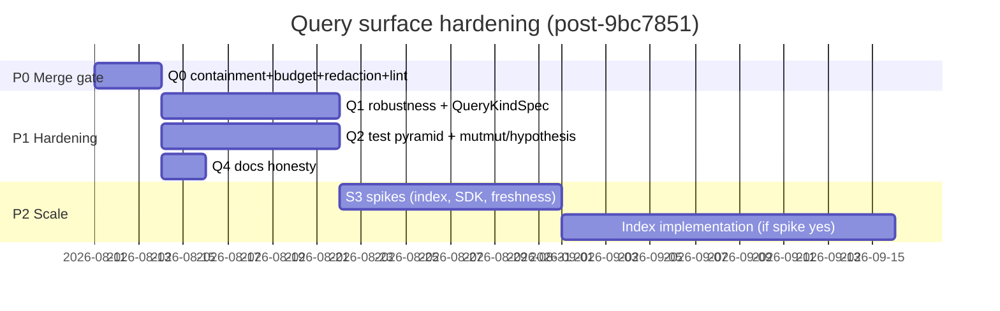

# Adversarial Review + Delivery Plan: PR #94 / `9bc7851`

**Commit:** [`9bc7851f1cae843107edfa5841d639f5f8cffa24`](https://github.com/huntyyyyyy/spring-boot-doc-agent/pull/94/changes/9bc7851f1cae843107edfa5841d639f5f8cffa24)  
**PR:** [#94 — Harden Stage-0 gates for untrusted target repos (Wave 1)](https://github.com/huntyyyyyy/spring-boot-doc-agent/pull/94)  
**Commit title:** Add Stage-0 typed query, context_packet, and thin MCP adapter  
**Scope:** 47 files, +3101 / −26  

**Audience:** Principal / senior engineers + engineering management  
**Purpose:** Merge gate, epic backlog, research spikes, ticketable work, external references  
**Re-verified:** 2026-08-08 (static code + live adversarial probes against local tree)

---

## 0. One-page verdict

| Question | Answer |
|---|---|
| Merge this commit as-is? | **No.** |
| Architecture direction sound? | **Yes** — Strategy handlers/providers, SoR-on-disk, thin MCP adapter. |
| Contract claims true? | **No** — containment is opt-in; token budget under-reports; risks channel dead on real artifacts. |
| Blocking before merge? | **C1, C2, H1, H2** + ruff F401. |
| Management framing | Ship as **Wave 2.0 (query surface)** after a **P0 containment + budget fix** PR; do not fold into Wave 1 hygiene narrative without a security sign-off. |

This commit adds an agent-facing **read API over Stage-0 artifacts**. On a PR whose threat model is *untrusted target repos + prompt injection*, an open path reader and a nominal budget are not “follow-ups” — they are merge blockers.

---

## 1. Assessment of prior review (`docs/reviews/9bc7851_PR_94.md` v1)

### What held up under re-verification

| Claim | Probe result (2026-08-08) | Status |
|---|---|---|
| C1: MCP/`dispatch_tool` without `root` reads arbitrary JSON/JSONL | `query_facts` on tempfile → `count:1`, MCP `isError: false` | **Confirmed** |
| C2: `estimate_tokens` excludes `payload`; emission includes it | `used=33`, real `chars//4=1035` on one fat item | **Confirmed** (~31×) |
| H1: `route-trace` `limit=1` still ships 400 nested guards; `truncated=false` | `37260` bytes, `truncated=False` | **Confirmed** |
| H2: dict-shaped `redaction_zones` → empty risks | dict→0 items; list fixture→1 item | **Confirmed** |
| H3: unknown bucket → empty success | `bucket=secuirty` → `count=0` | **Confirmed** |
| M1: `AssumeIndexed` → always `fresh_indexed` | `"does/not/exist.java"` → `fresh_indexed` | **Confirmed** |
| Strategy seam real (`FakeProvider`) | Test + design match | **Confirmed** |

### Review quality scorecard

| Dimension | Grade | Notes |
|---|---|---|
| Evidence discipline | A− | Named probes, mutation table, coverage snapshot |
| Severity ranking | A | C1/C2 correctly ahead of OCP nits |
| Completeness | B | Missed budget-allocation overshoot, spike↔code contradiction, EvidenceProvider dead comment, CLI/`run_dir` as co-equal C1 vectors |
| External grounding | C | Thin on MCP threat literature / reference servers |
| Editorial | B− | Typo “MPC”; duplicate AssumeIndexed mutant row; CVSS-adjacent without vector |
| Actionability | A | Week-ordered remediation is usable as a sprint plan |

**Disposition of v1:** Keep findings C1–H4 / M1–M5. Promote CLI + `run_dir` into C1. Add **N\*** findings below. Replace “Week 1/2/3” with epic/spike/ticket structures for planning systems.

---

## 2. Architecture snapshot (what landed)

```
CLI (query_artifacts) ──┐
MCP stdio (adapters/mcp)─┼─► mcp_tools.dispatch_tool / registry.run_query
                         │         │
                         │         ├─ handlers/*   (Strategy per kind)
                         │         └─ packet.run_context_packet
                         │                   │
                         │                   ├─ providers/* (Strategy per source)
                         │                   ├─ rank.trim_to_budget
                         │                   └─ freshness.*Policy
                         ▼
              load._resolve(root?) → spring_signals.json / facts.jsonl
```

**Patterns present (correct intents):**
- **Strategy** — query kinds + packet providers (proven by `test_fake_provider_strategy`).
- **Facade** — CLI → `query_artifacts.main`.
- **Adapter** — thin MCP shell; SoR stays in `doc_engine.query`.
- **Envelope / DTO** — `QueryResult`, context_packet schema.

**Patterns missing or half-applied:**
- **Policy / Capability** — root is caller-supplied (should be server-pinned).
- **Registry as single source of truth** — `_HANDLERS` exists; CLI + MCP still hand-wired (OCP break).
- **Circuit breaker / bulkhead** — MCP loop dies on uncaught exceptions (H4).
- **Index / materialized view** — every query full-scans artifacts (DDIA decision deferred; spike said “No SQLite”).

---

## 3. Critical & high findings (re-verified + new)

### C1 — Arbitrary file read: containment opt-in; nothing opts in

**Severity: Critical (Information Disclosure / Confused Deputy)**

```24:38:src/doc_engine/query/load.py
def _resolve(path: Path, *, root: Path | None) -> Path:
    ...
    if root is not None:
        ...
        if not is_path_inside_root(...):
            raise QueryPathError(...)
```

```47:57:src/doc_engine/query/mcp_tools.py
    if name == "query_evidence":
        return run_query(
            "evidence",
            signals_path=args["signals"],
            root=Path(str(args["root"])) if args.get("root") else None,
```

**Attack surfaces (all live without `root`):**
1. MCP `tools/call` (proved).
2. `dispatch_tool` library path (proved).
3. Allowlisted `Bash(doc-engine query:*)` in `.claude/settings.json` — **same opt-in `--root`**.
4. `context_packet` `run_dir` — any directory containing readable `spring_signals.json` / `facts.jsonl`.

**Threat-model fit:** PR #94 is Wave 1 *untrusted tree hygiene*. Allowlisting a general JSON reader next to denied `grep`/`curl` inverts the permission model. Aligns with MCP ecosystem findings: no ambient least privilege ([arXiv:2503.23278](https://arxiv.org/abs/2503.23278), [arXiv:2509.06572](https://arxiv.org/html/2509.06572v5) parasitic toolchain / UPD).

**Reference implementation to adopt concepts from:**
- [`modelcontextprotocol/servers` → `src/filesystem`](https://github.com/modelcontextprotocol/servers/tree/main/src/filesystem) (~87k★ parent): **refuse to start without allowed directories**; Roots protocol; `list_allowed_directories`. DeepWiki index: [deepwiki.com/modelcontextprotocol/servers](https://deepwiki.com/modelcontextprotocol/servers).
- Microsoft Wassette MCP threat model: capability-based FS, confused-deputy framing.

**Fix (non-negotiable):**
1. MCP: pin `DOC_ENGINE_ROOT` / `DOC_ENGINE_RUN_DIR` at process start; **never** accept caller `root`.
2. `_resolve`: require root (assert / raise).
3. CLI: default root = run artifact dir or CWD under operator control; `--unsafe-no-root` only on CLI, never MCP.
4. Tests: `dispatch_tool("query_facts", {"facts": "/etc/passwd"})` → `QueryPathError` with no root arg.

---

### C2 — `tokensUsed` under-reports; budget does not bound serialized output

**Severity: Critical (Broken contract / DDIA backpressure failure)**

Spike decision ([`claude/research/context-packet-schema-spike-2026-08-07.md`](../../claude/research/context-packet-schema-spike-2026-08-07.md)):

> Token proxy for budget: `chars // 4` over **JSON serialization of kept items**

Implementation deliberately diverges:

```68:89:src/doc_engine/query/rank.py
def estimate_tokens(obj: Any) -> int:
    """Chars/4 proxy. For context items, ignore bulky ``payload`` (DDIA budget)."""
    ...
        slim = {k: obj.get(k) for k in ("provider", "path", ...)}  # no payload
```

Emission still attaches full `payload` (`packet._score_raw`, `providers._item`).

**Probe:** budget-irrelevant single item → `tokensUsed=33`, real proxy `1035` (~31×). Prior review’s 27× on a 30-row construction remains directionally correct.

**New detail:** this is not an accidental miss — the docstring *names* the exclusion. Either the spike was overturned without an ADR, or the docstring rationalizes a bug. Treat as **decision debt**: reopen E1-S2.

**agentmako alignment:** Mako packets return ranked **pointers** (~600 tokens) not row dumps; FAQ claims grep paths burn 5–15k. Prefer **Option A (index packet)** from v1.

---

### H1 — Nested fan-out unbounded; `truncated` lies

`apply_limit` caps top-level rows only. `route_trace` embeds full `guards[]` per row. Probe: 1 row, 400 guards, `truncated=false`, ~37 KB.

Same class: `entity.candidates`, dependents payloads, evidence blobs.

---

### H2 — `RedactionProvider` dead on production shape

Emitter + schema: `redaction_zones` is **`{rel_path: [hits…]}`** (`_scanner_filesystem.py`, `spring_signals.schema.json`).

Provider assumes **list**; non-list → `[]`.

Test fixture invents list shape → suite passes; production risks always empty → agents infer “no secrets.”

---

### H3 — Unknown filters → silent empty success

Violates the principle `QueryMissingError` established in `load.py`. Typo’d bucket/predicate → exit 0, `count:0`. Prefer: unknown key → error; present-but-empty → success with `filters_matched:0`.

---

### H4 — MCP fault isolation missing

Narrow `except (QueryError, KeyError, TypeError, ValueError)`. `RecursionError` / OOM-class / unexpected → process exit. No line-size / artifact-size / JSON-depth gates.

---

### N1 (new) — Budget *allocation* overshoots for tiny budgets

```python
primary = max(1, int(budget * 0.7))
finding = max(1, int(budget * 0.2))
risk = max(1, budget - primary - finding)
```

| budget | sum of buckets | overshoot |
|---:|---:|---|
| 0–2 | 3 | **yes** |
| ≥5 | = budget | no |

Even before C2, the three-way split can authorize more tokens than requested.

---

### N2 (new) — `EvidenceProvider` documents request-aware filtering; does not implement it

Comment: *“Prefer security / api when request mentions them.”*  
Code: `evidence.query_evidence(signals)` — all buckets, then score. Request only affects ranking, not retrieval cost. On large OCS corpora this is a latency/DoS footgun for agents.

---

### N3 (new) — Schema validation is decorative

`schema_check.validate_envelope` is a required-key subset check, **not** Draft-2020-12, and is **not** called on the emission path — only in a unit test. Fixtures omit required `repo_path` / `files_scanned` from `spring_signals.schema.json`.

---

### N4 (new) — Freshness semantics diverge from the system this packet clones

agentmako freshness ([docs](https://agentmako.drhalto.com/docs/concepts/freshness.html)): `live | fresh_indexed | stale | historical | contradicted | unknown`, change-based (hash), `freshnessPolicy`, daemon refresh.

This commit: four labels; `AssumeIndexed` lies; `live` ≈ re-hashed `fresh_indexed` with no agent-visible policy knob; no `contradicted`.

---

## 4. SOLID / patterns / DDIA

### SOLID

| Principle | Status | Evidence |
|---|---|---|
| SRP | Weak in `run_context_packet` | Load + fan-out + score + partition + budget + freshness + envelope in one function (~110 LOC) |
| OCP | Broken at boundaries | New kind ⇒ registry + CLI argparse + CLI if/elif + MCP if/elif + schemas |
| LSP | OK for providers | Duck-typed; FakeProvider works |
| ISP | OK | Narrow handler signatures |
| DIP | Cosmetic | `@runtime_checkable` protocols never `isinstance`-checked (0% coverage on `protocols.py`) |

### Creational / structural / behavioral (what to use next)

| Pattern | Why here | Priority |
|---|---|---|
| **Capability / Roots** (structural) | Pin FS authority like MCP filesystem server | P0 |
| **Registry + codegen/spec** (`QueryKindSpec`) | One place for CLI/MCP/schema | P1 |
| **Factory** for freshness policy | Extract packet.py:126–160 | P1 |
| **Decorator** for size/depth limits on load | Cross-cutting backpressure | P0 |
| **Circuit breaker** at MCP loop | Survive poison artifacts | P1 |
| **Flyweight / row_ref index** | Packet as index, not dump | P0 (C2 Option A) |
| **Null Object** for freshness | Replace lying `AssumeIndexed` with honest `UnknownFreshness` | P1 |

### DDIA mapping

| DDIA idea | Claimed | Actual |
|---|---|---|
| SoR vs derived views | Artifacts on disk; query is derived | True |
| Batch vs stream vs index | Spike: no SQLite | Every call re-parses full JSON/JSONL; dependents re-runs whole reference graph — **batch scan per request** |
| Backpressure | `limit` + `budgetTokens` | Nominal (C2, H1, N1) |
| Truth vs freshness | Labels on items | Labels incomplete / false (M1, N4) |
| Unbounded fan-out | hard_stops notes | Nested lists still unbounded |

---

## 5. Test / TDD / mutation / chaos gap analysis

### What is good

- Deviation-named tests (`"""Deviation: …"""`) — keep as house style.
- Three committed mutators in `scripts/ratchets/mutate.py` for limit / budget / freshness — all killable.
- Fail-closed corrupt JSON test.
- FakeProvider proves Strategy seam.

### What fails TDD

| Gap | Why it matters |
|---|---|
| Fixtures invent non-canonical `redaction_zones` | Certifies dead production path (H2) |
| `test_trim_to_budget_respects_token_proxy` asserts on estimate, not emitted JSON | Encodes C2 |
| `test_assume_indexed_when_no_repo` pins the lie | Blocks M1 fix |
| Confounded ranking test (bucket + overlap) | Request-term mutant survives |
| No boundary tests at `cap` / `cap+1` | Off-by-one survives |
| MCP: only `initialize` roundtrip | No `tools/call`, no DoS, no missing-root |
| OCS lane skipped in CI | Zero continuous signal |
| No property tests | Filter/budget algebra unexplored |
| No chaos / poison-artifact suite | H4 untested |
| No penetration-style harness | C1 not in CI as red team case |

### Recommended test pyramid for this surface

```
         ┌─────────────────────┐
         │ Chaos / poison MCP  │  stdin bombs, deep JSON, huge artifacts
         ├─────────────────────┤
         │ Integration         │  real run_dir fixtures + schema-validated signals
         ├─────────────────────┤
         │ Contract / schema   │  jsonschema Draft 2020-12 on envelopes
         ├─────────────────────┤
         │ Property (Hypothesis)│ budget algebra, limit bounds, path containment
         ├─────────────────────┤
         │ Unit + named mutants│ existing mutate.py + mutmut on query/*
         └─────────────────────┘
```

**Libraries / repos to adopt or learn from:**
| Tool | Stars / notes | Use |
|---|---|---|
| [boxed/mutmut](https://github.com/boxed/mutmut) (~1.3k★) | Broaden beyond hand mutators; CI incremental on `src/doc_engine/query/` |
| [Hypothesis](https://hypothesis.readthedocs.io/) | Property tests for `_resolve`, `apply_limit`, budget split |
| Existing `scripts/ratchets/mutate.py` | Keep as *named* regression mutants (project convention) |
| [modelcontextprotocol/python-sdk](https://github.com/modelcontextprotocol/python-sdk) (DeepWiki: [deepwiki](https://deepwiki.com/modelcontextprotocol/python-sdk)) | Optional later upgrade from hand-rolled JSON-RPC; auto JSON Schema from types |
| agentmako ([docs](https://agentmako.drhalto.com/docs/), [context packets](https://agentmako.drhalto.com/docs/concepts/context-packets.html)) | Product semantics: packet-as-index, freshnessPolicy, expandableTools |
| codebase-rag context packing ([royisme/codebase-rag docs](https://github.com/royisme/codebase-rag/blob/main/docs/guide/code-graph/context.md)) | Budget pack algorithm with category balancing + `ref://` handles |
| DRACO dataflow RAG ([arXiv:2405.19782](https://arxiv.org/pdf/2405.19782)) | Primary vs secondary context allocation under hard token caps |
| MCP-SandboxScan ([arXiv:2601.01241](https://arxiv.org/abs/2601.01241)) | Spike only: WASM sandbox for untrusted tool analysis — overkill for v1 fix, relevant if MCP grows |

**Penetration / chaos (pragmatic scope for this repo):**
- Red-team pytest module: path traversal, symlink escape (already partially tested when root set), missing root, `/etc/passwd`-shaped JSONL, NUL bytes, deep nesting, multi-MB artifacts, concurrent stdin flood (expect graceful error lines, process alive).
- Not full network pentest — product is local stdio/CLI — but treat agent as hostile confused deputy.

---

## 6. Epics, spikes, tickets

### Epic E-Q0 — Merge gate (P0, ~1–2 eng-days)

**Goal:** Make containment and budget claims true; restore risks channel; green lint.

| ID | Ticket | Est | Acceptance |
|---|---|---|---|
| Q0-1 | Mandatory server-derived root for MCP + `_resolve` | 0.5d | Probe C1 fails closed; env required at server start |
| Q0-2 | Budget counts serialized emission **or** drop payload → `row_ref` | 1d | `len(json.dumps(pkt))//4 <= budgetTokens` **or** `truncated` with real sizes; spike ADR updated |
| Q0-3 | Cap nested fan-out (`guards`, `candidates`); set `truncated` | 0.5d | H1 probe fails (truncated true or nested capped) |
| Q0-4 | Fix `RedactionProvider` for dict zones + canonical fixture factory | 0.5d | Real emitter shape → non-empty risks when zones present; schema validate fixtures |
| Q0-5 | ruff F401 + extend lint to `adapters/` | 0.1d | `ruff check` green |

**Exit:** “Do not merge” → mergeable for query surface behind feature flag / documented threat model.

---

### Epic E-Q1 — Query surface robustness (P1, ~1 sprint)

| ID | Ticket | Est | Acceptance |
|---|---|---|---|
| Q1-1 | MCP bulkhead: catch-all at stdin loop; MAX_LINE / MAX_DEPTH / MAX_ARTIFACT_BYTES | 1d | Poison artifact does not kill process |
| Q1-2 | Filter validation: unknown bucket/predicate → `QueryError` with valid set | 0.5d | H3 probe raises |
| Q1-3 | `QueryKindSpec` single registry → CLI + MCP `inputSchema` + dispatch | 2d | Adding a kind = one spec entry; MCP schemas list real params |
| Q1-4 | Freshness honesty: `AssumeIndexed` → `unknown`; document `live` vs `fresh_indexed` | 0.5d | M1 fixed; docs match |
| Q1-5 | Enforce `PacketProvider` / `FreshnessPolicy` via `isinstance` | 0.25d | Malformed provider → TypeError |
| Q1-6 | Wire `validate_envelope` (+ optional jsonschema) on CLI `--validate` and tests | 0.5d | Emission path can fail closed on bad envelopes |

---

### Epic E-Q2 — Test adequacy (P1, continuous)

| ID | Ticket | Est | Acceptance |
|---|---|---|---|
| Q2-1 | Hypothesis properties: containment, limit boundaries, budget split algebra (incl. N1) | 1d | Properties in CI profile `ci` (derandomize) |
| Q2-2 | Expand `mutate.py` mutants: RedactionProvider kill, nested cap, request-overlap isolation, missing-root | 0.5d | Named mutants killed |
| Q2-3 | mutmut incremental job on `src/doc_engine/query/` (nightly) | 1d | Mutation score ratchet documented |
| Q2-4 | MCP integration: `tools/call` success + error + missing root + huge line | 1d | Coverage on `server.py` > 80% |
| Q2-5 | Poison/chaos suite (see §5) | 1d | Process stays up; errors JSON-RPC shaped |
| Q2-6 | Unskip or hermeticize one OCS fixture slice in CI | 1–2d | At least one real-artifact test runs without env |

---

### Epic E-Q3 — Indexing & scale (P2, research → build)

Spike-first: commit explicitly chose **no SQLite**. At OCS scale, dependents + full evidence scans will dominate.

| ID | Type | Question | References |
|---|---|---|---|
| S3-1 | Spike (3d) | Materialize Stage-0 → SQLite/Parquet vs mmap JSON index vs keep full scan? | agentmako SQLite index; DDIA Ch.3/10; codebase-rag packing |
| S3-2 | Spike (2d) | Adopt packet-as-`row_ref` + lazy `query_*` expansion (Mako expandableTools) | [agentmako context tools](https://agentmako.drhalto.com/docs/tools/context.html) |
| S3-3 | Spike (2d) | Ranking: keep lexical overlap vs BM25/hybrid? Hold constant buckets in eval harness | DRACO [arXiv:2405.19782](https://arxiv.org/pdf/2405.19782); partition_repo heuristics already in-repo |
| S3-4 | Spike (2d) | Upgrade thin MCP shell → official Python SDK for schema-from-types | [python-sdk DeepWiki](https://deepwiki.com/modelcontextprotocol/python-sdk); keep `dispatch_tool` as SoR |
| S3-5 | Spike (1d) | FreshnessPolicy parity with Mako (`prefer_fresh` / `require_fresh` / `allow_stale`) | [Mako freshness](https://agentmako.drhalto.com/docs/concepts/freshness.html) |
| S3-6 | Spike (2d) | MCP sandbox / capability model if tools ever leave read-only | [arXiv:2601.01241](https://arxiv.org/abs/2601.01241), Wassette threat model, [arXiv:2508.12538](https://arxiv.org/html/2508.12538v1) |

**BFS/DFS research note (how to continue):** Start at agentmako `context_packet` docs → follow `expandableTools` / Reef freshness → compare to this repo’s `providers.py` + `freshness.py`. From MCP servers README → filesystem Roots → map to `DOC_ENGINE_ROOT`. From arXiv MCP landscape → parasitic toolchain → back to `.claude/settings.json` allowlist. Stop when a node no longer changes an acceptance test or epic exit criterion.

---

### Epic E-Q4 — Product / docs honesty (P1 parallel)

| ID | Ticket | Acceptance |
|---|---|---|
| Q4-1 | SEARCH.md / product-architecture: remove “capped” claims until Q0 done | Docs match probes |
| Q4-2 | ADR: overturn or reaffirm E1-S2 token proxy (payload in or out) | Single decided sentence in `claude/research/` |
| Q4-3 | Commit message / PR body: “OCS lane” → “optional local lane, skipped in CI” | No false CI confidence |
| Q4-4 | Agent prompts: require `root`/run_dir from orchestrator; never invent absolute paths | Prompt + deny-test |

---

## 7. Suggested program timeline



**Management checkpoint after Q0:** security review sign-off that agent allowlist + MCP cannot read outside run root.

---

## 8. Clarifying questions (still decide severity)

1. **Is MCP pointed at artifacts from repos the agent also reads?** If yes, C1 stays Critical. If local-dev only on trusted checkouts, still High (allowlist), but can stage behind env flag.
2. **Is `payload` load-bearing for agents?** If yes → count it (Option B). If no → drop / `row_ref` (Option A, preferred).
3. **Was list-shaped `redaction_zones` fixture from memory?** If yes, audit *all* query fixtures for schema drift (N3).

---

## 9. Design principles checklist (definition of done for the query surface)

- [ ] **Least privilege:** server-derived root; no caller override on MCP.
- [ ] **Honest envelopes:** `truncated` / `tokensUsed` describe bytes agents receive.
- [ ] **Fail closed:** unknown filters, missing artifacts, poison input → errors, not empty success / process death.
- [ ] **Canonical fixtures:** every test signals doc validates against `spring_signals.schema.json`.
- [ ] **Single registry:** one `QueryKindSpec` drives CLI, MCP, schemas.
- [ ] **TDD:** deviation-named test first; mutant in `mutate.py` for each safety invariant.
- [ ] **Measurable backpressure:** property test `serialized_tokens <= budget ∨ truncated`.
- [ ] **Freshness non-lying:** no store ⇒ `unknown`, never `fresh_indexed`.
- [ ] **Docs = probes:** SEARCH.md claims greppable against pytest node ids.

---

## 10. Conclusion

The prior adversarial review was **substantively correct** and is upgraded here with re-probes, four new defects (N1–N4), spike contradiction analysis, and an epic/spike backlog grounded in MCP security literature, agentmako semantics, MCP filesystem Roots, mutmut/Hypothesis, and DDIA indexing choices.

**Do not merge `9bc7851` until Epic E-Q0 lands.** Architecture can stay; wiring and contracts must match the threat model this PR claims to harden.
