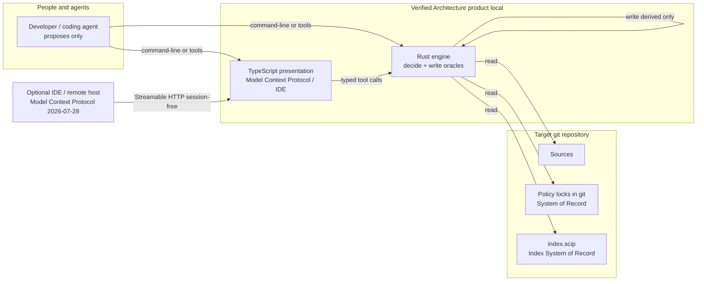
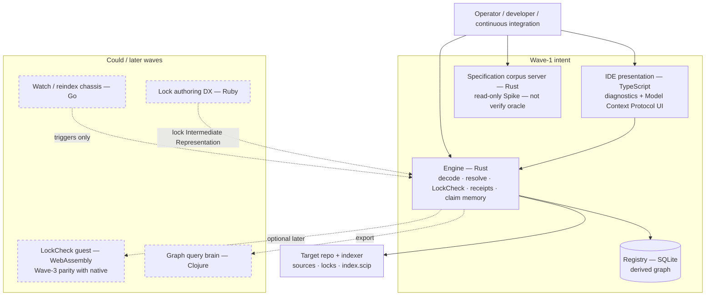
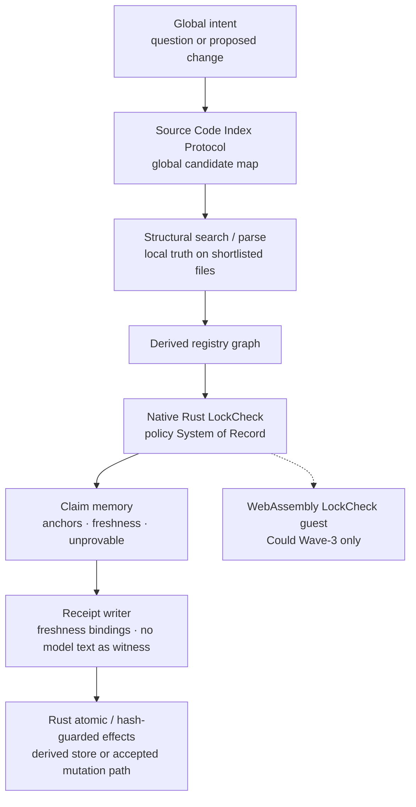
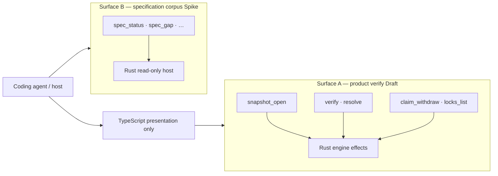
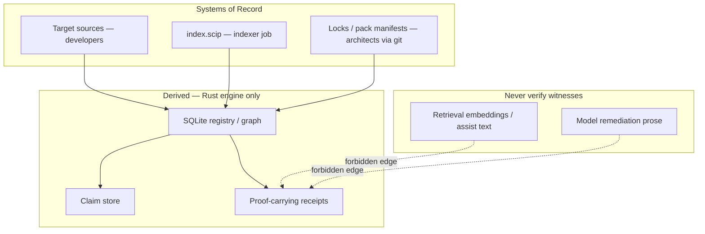
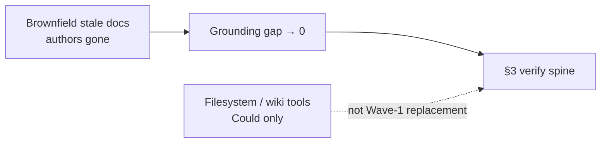

# Architecture visualization (Draft)

**Banner:** Definition of Ready has **zero** PASS rows. These diagrams are
**shape confidence**, not permission to open product crates. Scores and boxes
do not equal Implement readiness (~0.15).

Whole words — root `GLOSSARY.md`. Companion ASCII: `C4-BRIEF-CONFIDENCE.md`.
Poster: `verified-architecture-system-design-draft.png`.

---

## 1. Context — who talks to what

**Out of minimum viable product:** org SaaS / Backstage mesh. **Refuse:** Python
as engine or specification-corpus host.

---

## 2. Containers — Wave-1 vs later Could

Solid boxes = Wave-1 **intent** (still Pilot / Draft). Dashed = Could / refused.

---

## 3. Inside the engine — verify pipeline

Corrected “Agent operating-system” flow: global map → local truth → **native**
spine → atomic write. WebAssembly is not the spine.

| Step | Job | Fail-mode if skipped or inverted |
| --- | --- | --- |
| Index map | Scale lookup | Structural search over the whole tree every turn |
| Local truth | Citation-grade check of current bytes | Trust stale index alone |
| Native LockCheck | Policy decide | Putting WebAssembly here as Must spine |
| Claim memory | Survive upstream edits | Stale “green” docs/answers |
| Receipt | Grounding gap toward zero | Model prose as proof |
| Atomic write | Engine owns effects | Model writes oracles / free shell |

---

## 4. Dual Model Context Protocol surfaces

Do not merge these into one mega-tool list.

Wire pin: Model Context Protocol **2026-07-28** (session-free; handles as
arguments). Tool *semantics* remain Pilot invent until Accept.

---

## 5. System of Record versus derived

---

## 6. Stakeholder grounded-doc pressure (not Accepted)

Discovery metrics (index lag, stale fragments, grounding gap) reinforce Fresh +
claims. A thin filesystem tool stack (read / ripgrep / tree / apply-diff / wiki)
is **Could adapter** until open question on product boundary is Accepted — it
does **not** replace the diagram in §3.

---

## 7. How to read this pack

| Document | Use |
| --- | --- |
| This file | Mermaid overview |
| `C4-BRIEF-CONFIDENCE.md` | ASCII + shape confidence scores |
| `ARCHITECTURE_BRIEF.md` | Decisions table + topology prose |
| `docs/c4/02-containers.md` | Polyglot container C4 |
| `VERIFY_STACK.md` | Four Must-intent legs |
| `STATUS.md` | FREEZE + Implement Refuse |

**Human still owns:** product-boundary Accept (Q1–Q4 in stakeholder discovery
memo) and Wave-0 signoff. Diagrams do not close those.
