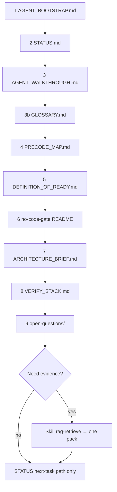

# Agent walkthrough

No chat history. Open the chain below; do not breadth-scan. Whole words —
`GLOSSARY.md`.

## Automatic (Cursor / Cloud)

| Load | Bound |
| --- | --- |
| `00-constitution.mdc`, `01-rag-progressive-disclosure.mdc` | Only two `alwaysApply` |
| `AGENTS.md` | Ingest pointer → bootstrap — not a second rule set |

All other paths are on-demand (globs, Skills, or this chain).

## Mandatory chain



| Step | Path | Attribute gained |
| --- | --- | --- |
| 1 | `AGENT_BOOTSTRAP.md` | Hard refuses + stack owners |
| 2 | `STATUS.md` | FREEZE deepen-3 + single next task |
| 3 | this file | Stop rules + task branches |
| 3b | `GLOSSARY.md` | Bare short forms banned in prose |
| 4 | `PRECODE_MAP.md` | Where new files land (`00/`–`12/`) |
| 5 | `00-governance/dor-dod/DEFINITION_OF_READY.md` | Code-gen gate rows (0 PASS) |
| 6 | `12-delivery/no-code-gate/README.md` | Product crates → reject |
| 7 | `07-system-design/ARCHITECTURE_BRIEF.md` | Shape / leaders |
| 8 | `08-verification/VERIFY_STACK.md` | Four-leg Must spine |
| 9 | `04-constraints/open-questions/` | What still blocks Implement |
| 10 | `PORT_READY.md` | Export CONDITIONAL ≠ Implement |

**Stop:** no wholesale `research/**`; no `nests/**` unless that option is the
task; no legacy `docs/**` write unless promoting into `00/`–`12/`.

## Task branches (after step 9)

| STATUS next task | Open |
| --- | --- |
| Boundary / open question 01 | `01-vision/problem-frame/BOUNDARY.md` |
| Receipts / claim memory | `08-verification/receipts/` + `claim-memory/` |
| Tool constraints | `08-verification/stead/` + `SPIKE-STEAD-equivariance.md` |
| Ports / Interface Control Document | `07-system-design/ports-and-adapters/PORTS.md`, `icd/` |
| Quality Attribute Scenarios | `03-requirements/qas/` |
| Port / Definition of Ready | `PORT_READY.md` + Definition of Ready |
| June–August readiness | `research/papers-2026-may-aug/june-august-2026-port-readiness.md` (one file) |
| Overturn | `research/adversarial/july-august-2026-overturn-review.md` (one file) |

## Paste prompt

```text
Root = this planning corpus. No prior chat. Whole words (GLOSSARY.md).
Read: AGENT_BOOTSTRAP → STATUS → AGENT_WALKTHROUGH → GLOSSARY.
Skill cold-start. No product code. Must spine = graph + locks + claim memory
+ Stateful Tool-Enabled Agentic Deployment constraints (VERIFY_STACK.md).
Work only the single next task in STATUS.md.
```
