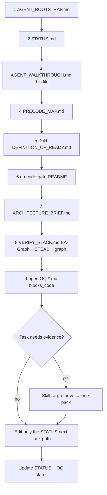

# Agent walkthrough — what gets opened, in order

Use this when the folder is the **root** of a new GitHub/Cursor project.
No chat history. Follow the steps; do not breadth-scan the whole tree.

## Automatic context (Cursor loads without you asking)

```text
alwaysApply (.cursor/rules/)
  1. 00-constitution.mdc          ← identity + gates + cold-start pointer
  2. 01-rag-progressive-disclosure.mdc  ← don't dump research/

Cloud / ingest may also inject:
  AGENTS.md                       ← thin pointer → bootstrap
```

Everything else is **on demand** (globs, agent-requested, Skills, or this list).

---

## Mandatory human/agent read chain (do not skip)



| Step | File | Why |
| --- | --- | --- |
| 1 | `AGENT_BOOTSTRAP.md` | Priming packet / refuses |
| 2 | `STATUS.md` | Phase + **single next task** |
| 3 | `AGENT_WALKTHROUGH.md` | This chain + structure visual |
| 4 | `PRECODE_MAP.md` | Where new files go (`00/`–`12/`) |
| 5 | `00-governance/dor-dod/DEFINITION_OF_READY.md` | Codegen gate rows |
| 6 | `12-delivery/no-code-gate/README.md` | Hard Refuse product code |
| 7 | `07-system-design/ARCHITECTURE_BRIEF.md` | Shape / MVP / leaders |
| 8 | `08-verification/VERIFY_STACK.md` | **Graph+locks ∧ EA-Graph ∧ STEAD** |
| 9 | `04-constraints/open-questions/OQ-*.md` | What still blocks |

**Stop.** Do not open `research/**` wholesale. Do not open `nests/**` unless the
task is that BC option. Do not open legacy `docs/**` unless promoting into `00/`–`12/`.

---

## Task-shaped branches (after step 9)

| If STATUS says… | Open next |
| --- | --- |
| Boundary / OQ-01 | `01-vision/problem-frame/BOUNDARY.md` |
| Receipts / EA-Graph | `08-verification/receipts/` + `claim-memory/` |
| STEAD / MCP tools | `08-verification/stead/` + `SPIKE-STEAD-equivariance.md` |
| Ports / ICD | `07-system-design/ports-and-adapters/PORTS.md`, `icd/` |
| QAS | `03-requirements/qas/TEMPLATE.md` |
| Papers / overturn | `research/adversarial/july-august-2026-overturn-review.md` **one file** |

---

## Paste prompt for the new repo

```text
Repo root is this planning corpus. No prior chat.
Read in order: AGENT_BOOTSTRAP.md → STATUS.md → AGENT_WALKTHROUGH.md.
Obey Skill cold-start. Do not write product code.
Must spine = graph + locks + EA-Graph claim memory + STEAD tool constraints
(see 08-verification/VERIFY_STACK.md) — not graph+locks alone.
Work the single next task in STATUS.md.
```
