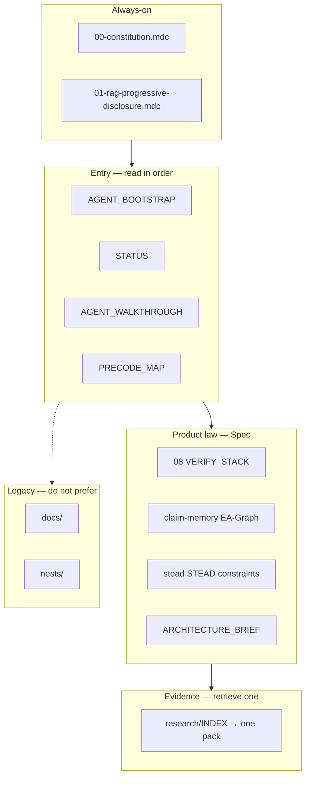
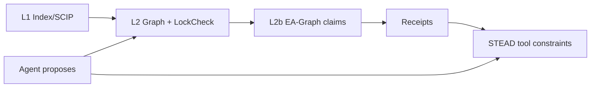

# Structure visual

## Tree (what you push as the new repo root)

```text
verified-architecture/          ← make THIS the git root
│
├── AGENT_BOOTSTRAP.md          ★ cold start #1
├── STATUS.md                   ★ cold start #2
├── AGENT_WALKTHROUGH.md        ★ sequential chain + mermaid
├── STRUCTURE.md                ★ this file
├── PRECODE_MAP.md
├── HOW_TO_PRIME_AGENTS.md
├── AGENTS.md                   (thin Cloud ingest)
├── CONTRIBUTING.md
├── EXPORT.md
├── README.md
├── PROVENANCE.md
│
├── .cursor/
│   ├── rules/                  (≤2 alwaysApply; rest globs/requested)
│   └── skills/                 cold-start, fill-wave-gap, rag-retrieve, promote-claim
│
├── 00-governance/              DoR, claim tiers, promotion
├── 01-vision/                  BOUNDARY.md
├── 02-stakeholders/            actors, opscon, signoff
├── 03-requirements/            strs, srs, qas, rtm, use-cases
├── 04-constraints/             CON + OQ-01…08
├── 05-quality-architecture/    ATAM, tactics, tradeoffs, formal
├── 06-domain/                  ubiquity, BCs, info model, UNKNOWN-TAXONOMY
├── 07-system-design/           ARCHITECTURE_BRIEF, ports, icd, adr, options, c4
├── 08-verification/            ★ VERIFY_STACK + L1/L2/L3 + receipts + claim-memory + stead
├── 09-product-tours/           proof-tour, lsp, ghost, lock-sync, polyglot-bell
├── 10-rag-corpus/              catalog, packs, retrieval contracts, eval
├── 11-science-transfer/        locked transfers / refuse substrates
├── 12-delivery/                waves, spikes, no-code-gate, pilot-before-refuse
│
├── research/                   evidence (retrieve one pack — never always-load)
│   ├── INDEX.md
│   ├── adversarial/            incl. july-august-2026-overturn-review.md
│   ├── papers-2026-may-aug/
│   ├── leaders-adoption/
│   ├── pre-code-bfs/
│   ├── mdc-devex/
│   ├── polyglot/ atam-formal/ layers-of-truth/
│   └── …
│
├── docs/                       LEGACY flat RE/C4/ADR (prefer 00–12 for new work)
└── nests/                      LEGACY language placeholders → prefer 07/.../options/
```

## Authority layers



## Verify stack (Must — not graph alone)


