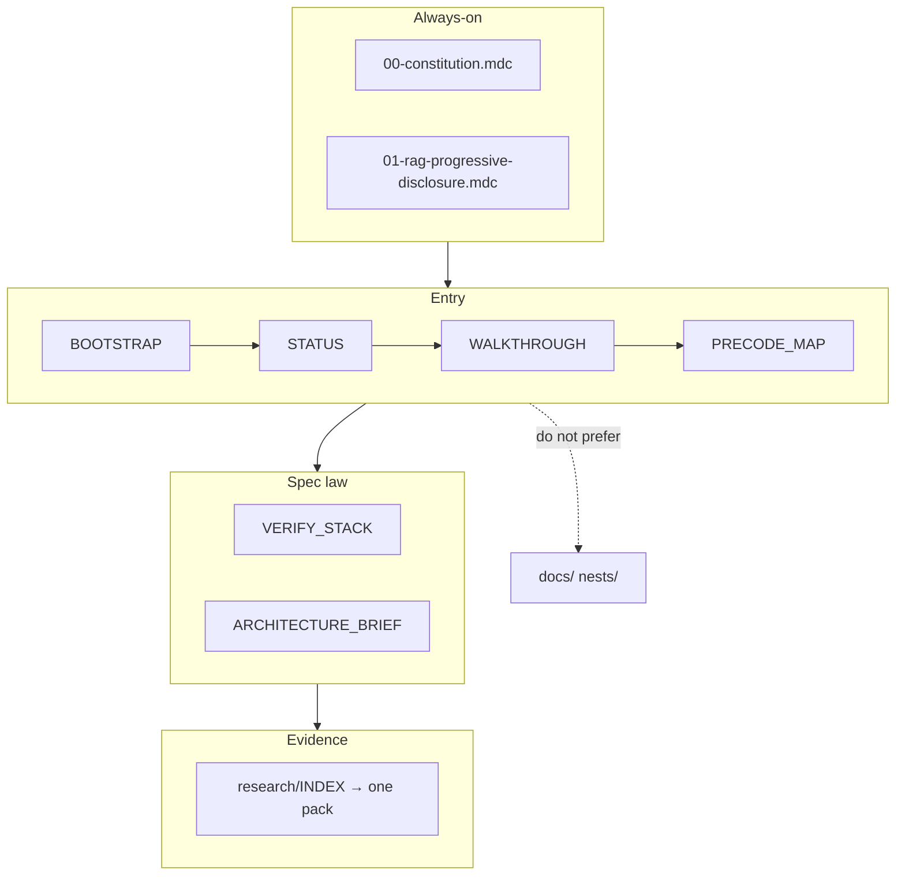
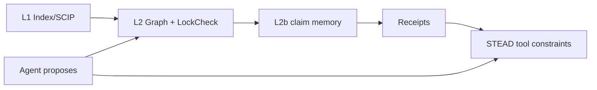

# Structure

## Tree (export root)

```text
verified-architecture/          ← git root when exporting
│
├── AGENT_BOOTSTRAP.md          ★ cold start #1
├── STATUS.md                   ★ FREEZE + next task
├── AGENT_WALKTHROUGH.md        ★ this chain
├── STRUCTURE.md                ★ this file
├── PRECODE_MAP.md              where new files go
├── HOW_TO_PRIME_AGENTS.md
├── AGENTS.md                   thin Cloud ingest
├── CONTRIBUTING.md
├── EXPORT.md / PORT_READY.md / PROVENANCE.md / README.md / GLOSSARY.md
│
├── .cursor/rules/              ≤2 alwaysApply; rest globs/requested
├── .cursor/skills/             cold-start, fill-wave-gap, rag-retrieve, …
│
├── 00-governance/              Definition of Ready System of Record
├── 01-vision/                  BOUNDARY.md (non-goals / success empty)
├── 02-stakeholders/            SIGNOFF_LOG (actors/opscon empty)
├── 03-requirements/            strs, srs, qas, rtm
├── 04-constraints/             constraints-wave1 + OQ-01…08
├── 05-quality-architecture/    EMPTY — .gitkeep only
├── 06-domain/                  UNKNOWN-TAXONOMY only; BC/info-model empty
├── 07-system-design/           brief, ports, icd; ADRs live in docs/adr/
├── 08-verification/            VERIFY_STACK + receipts + claim-memory + stead
├── 09-product-tours/           EMPTY — five .gitkeep tours
├── 10-rag-corpus/              EMPTY — live catalog = research/INDEX.md
├── 11-science-transfer/        locked transfers / refuse substrates
├── 12-delivery/                no-code-gate + spike charters (Rust Spec host)
│
├── research/                   evidence — one pack via INDEX.md
├── docs/                       ADR + C4 + standards active; REQs/CON pointers
└── nests/                      language options; 08 Python REFUSED
```

## Authority flow



## Must spine (not graph alone)



Stack locks: Rust Spec corpus Model Context Protocol; TypeScript IDE only;
WebAssembly LockCheck Could / Wave-3.
