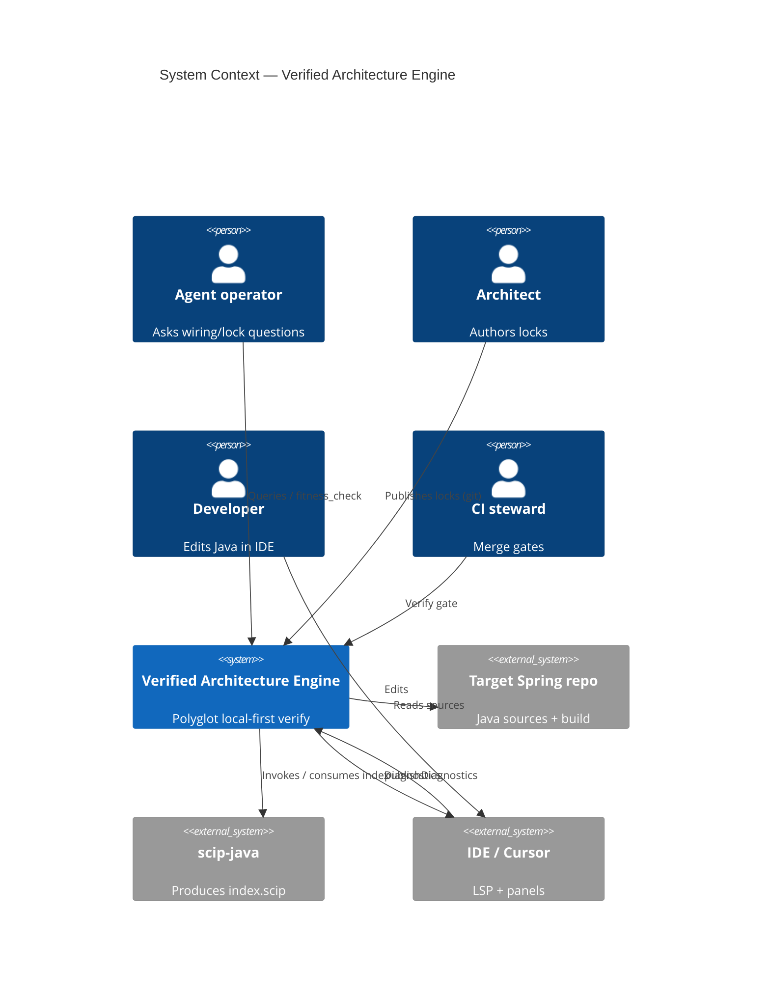

# Context

## In one sentence

Verified Architecture Engine helps operators, architects, and developers get
**traceable** Spring wiring and architecture-lock answers for a target codebase.

## Actors and externals

## Notes

- Target repo + locks (git) are System of Record inputs; indexes/registry are derived.
- large language model tools may assist remediation later; they are **not** context authorities.
