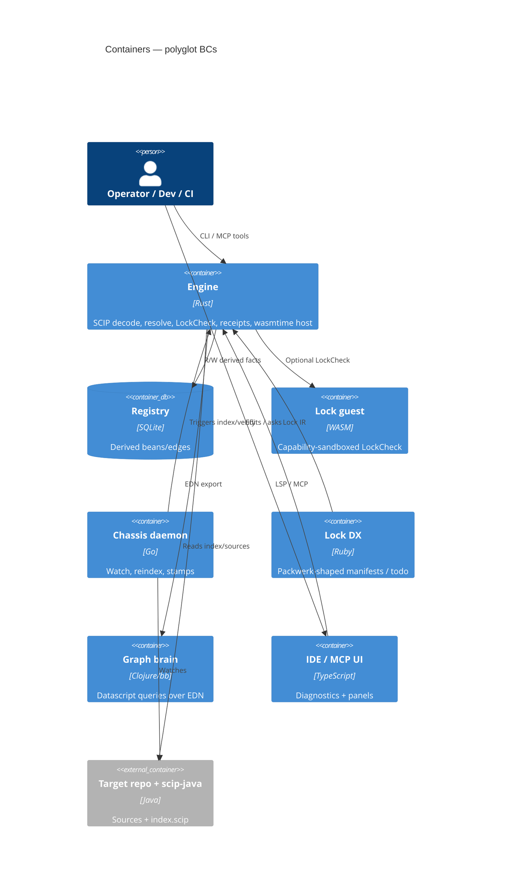

# Containers

One deployable/runtime unit per Accepted language (Architecture Decision
Record ADR-0001). **No Python container** — Refuse; nest 08 tombstoned;
revival = reject.

| Container | Language | Bound / fail-mode |
| --- | --- | --- |
| Engine | Rust | ADR-0007, ADR-0004 — sole oracle / Spec corpus Model Context Protocol host |
| Registry | SQLite | ADR-0002 — rusqlite writers only |
| Lock guest | WebAssembly | ADR-0004 — **Could / Wave-3**, not Must, not Spec host |
| Chassis | Go | ADR-0009 — triggers only; never oracle writer |
| Lock DX | Ruby | ADR-0003 — authors Intermediate Representation |
| Graph brain | Clojure | ADR-0005 — EDN read-mostly |
| IDE / Model Context Protocol UI | TypeScript | ADR-0010 — **presentation only** |
| Spec corpus Model Context Protocol | Rust | ADR-0007 + Spike — not TypeScript |
| C / Zig shims | C/Zig | earned Spikes only |
| ~~Optional ACI glue~~ | ~~Python~~ | **Refuse** — nest 08 tombstoned |
