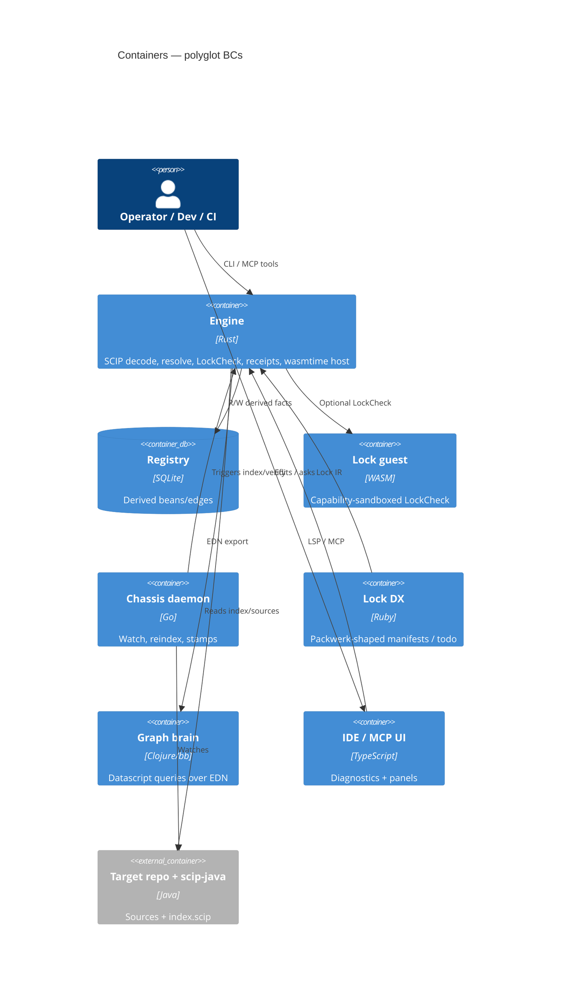

# Containers

Each container is a **first-class language BC** (ADR-0001). Python is optional
peer glue — not shown as the hub.

| Container | Language | ADR |
| --- | --- | --- |
| Engine | Rust | 0007, 0004 |
| Registry | SQLite | 0002 |
| Lock guest | WASM | 0004 |
| Chassis | Go | 0009 |
| Lock DX | Ruby | 0003 |
| Graph brain | Clojure | 0005 |
| IDE/MCP | TypeScript | 0010 |
| Optional ACI glue | Python | peer only — not required hub |
| C / Zig shims | C/Zig | earned Spikes |
