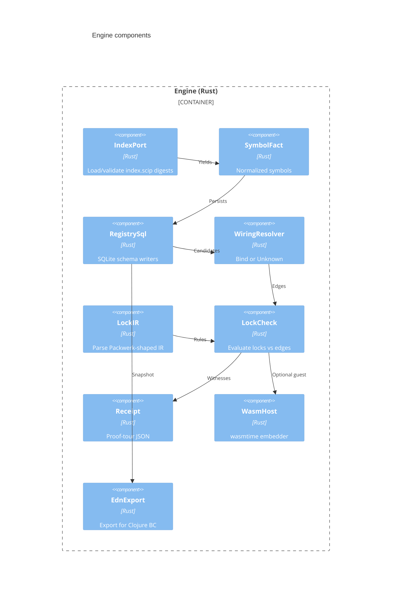

# Components — Engine (Rust)

```mermaid
C4Component
    title Engine components
    Container_Boundary(engine, "Engine (Rust)") {
        Component(index, "IndexPort", "Rust", "Load/validate index.scip digests")
        Component(facts, "SymbolFact", "Rust", "Normalized symbols")
        Component(reg, "RegistrySql", "Rust", "SQLite schema writers")
        Component(resolve, "WiringResolver", "Rust", "Bind or Unknown")
        Component(lockir, "LockIR", "Rust", "Parse Packwerk-shaped IR")
        Component(lockchk, "LockCheck", "Rust", "Evaluate locks vs edges")
        Component(receipt, "Receipt", "Rust", "Proof-tour JSON")
        Component(host, "WasmHost", "Rust", "wasmtime embedder")
        Component(export, "EdnExport", "Rust", "Export for Clojure BC")
    }
    Rel(index, facts, "Yields")
    Rel(facts, reg, "Persists")
    Rel(reg, resolve, "Candidates")
    Rel(resolve, lockchk, "Edges")
    Rel(lockir, lockchk, "Rules")
    Rel(lockchk, receipt, "Witnesses")
    Rel(lockchk, host, "Optional guest")
    Rel(reg, export, "Snapshot")
```

Other containers get Component diagrams before their Implement wave.
